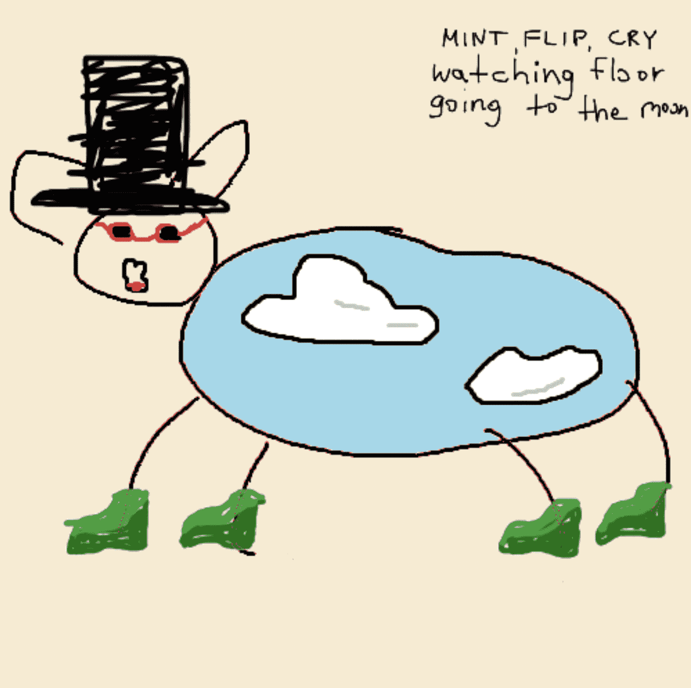

# shittysheep

**狗屎统计**

创建于 3 个月前，10,000 代币供应，5% 费用

在过去的 7 天里没有卖过狗屎羊。

我厌倦了地精衍生品，所以就是这样 - 狗屎羊是退化的新一代

你又错过了：）

shittysheep NFT - 常见问题（FAQ）
▶ 什么是狗屎羊？
shittysheep 是一个 NFT（不可替代令牌）集合。存储在区块链上的数字艺术品集合。
▶ 有多少shittysheep 代币？
总共有 10,000 个shittysheep NFT。目前，3,889 位车主的钱包中至少有一个shittysheep NTF。
▶ 什么是最昂贵的shittysheep 销售？
出售的最昂贵的shittysheep NFT 是 Shitty Sheep #1006。它于 2022-06-07（3 个月前）以 10.9 美元的价格售出。
▶ 最近卖了几只狗屎羊？
过去 30 天内售出了 36 个shittysheep NFT。
▶ 一只狗屎羊要多少钱？
在过去 30 天里，最便宜的shittysheep NFT 销售额低于 1 美元，最高销售额超过 11 美元。过去 30 天内，shittysheep NFT 的中位价格为 2 美元。
▶ 什么是流行的shittysheep 替代品？
许多拥有shittysheep NFT 的用户也拥有 greedygoblins.wtf、 Goblin Kids、 wtf.pipl？和 BOBO DEGEN 天启。

