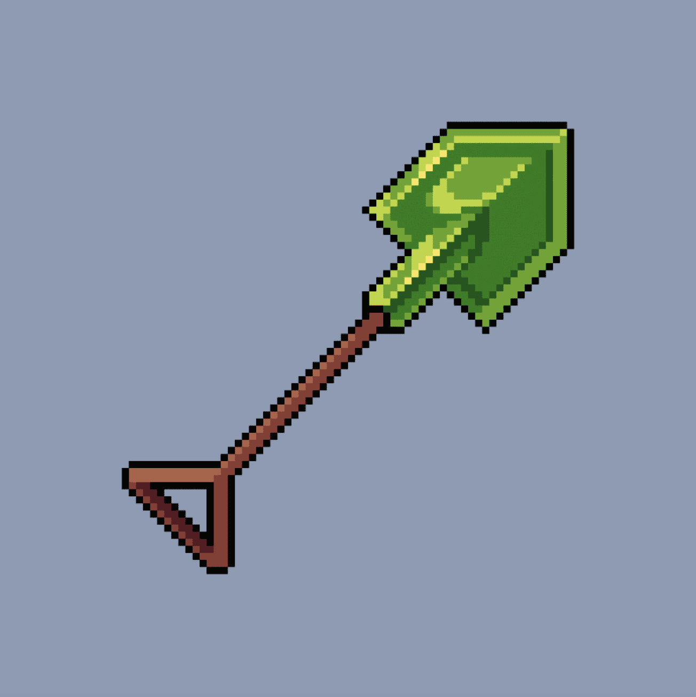

# SHOVELS

什么是铲子？
ANON，你说你的砾石需要一把铲子？ 好吧，铲子就在这里。 SHOVELS 是以太坊区块链上 5000 NFTS 的集合。 每铲 NFT 是 0.03 ETH 到 MINT。 您一次最多可以铸造 30 个铲子 NFTS。

SHOVELS NFT - 常见问题（FAQ）

▶ 什么是铲子？

SHOVELS 是一个 NFT（不可替代代币）集合。存储在区块链上的数字艺术品集合。

▶ 存在多少个 SHOVELS 代币？

总共有 5,000 个 SHOVELS NFT。目前，1,014 位所有者的钱包中至少有一个 SHOVELS NTF。

▶ 最近卖出了多少 SHOVELS？

过去 30 天内售出 0 SHOVELS NFT。

