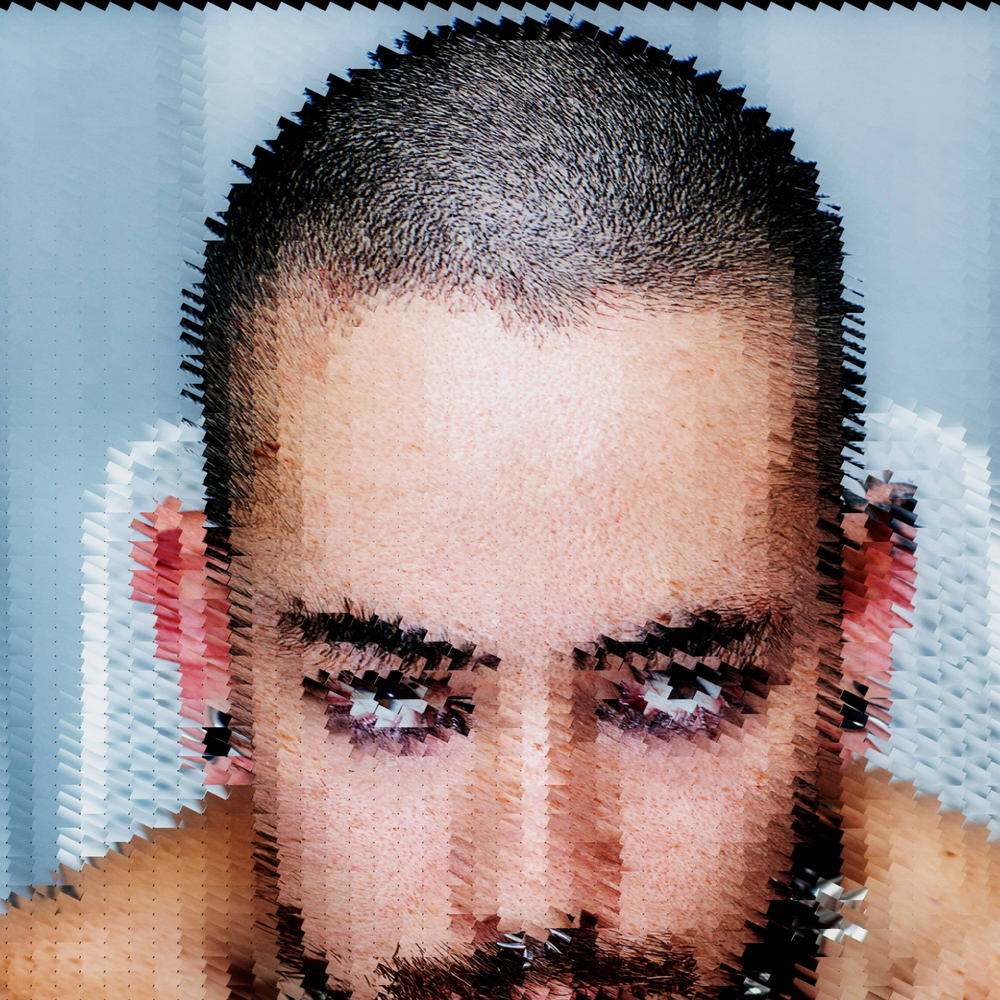

# Shredders by Zak Krevitt

拥抱可变性，拒绝限制，粉碎二进制文件。
一张照片上的150种算法变化。
稀有性状，4k分辨率，ERC-721令牌。
免费薄荷作为礼物送给web3社区。[售罄]

现在在OpenSea和LooksRare上交易

Zak Krevitt的1/1s收藏家仍然可以在这里索取免费的碎纸机。

碎纸机是使用AfterEffects内部的代码制作的。记录与层数、颜色、失真和尺寸相关的不同参数边界，并将其与每个令牌的元数据（稀有性特征）相关联。

在生成了大约6，000个变体之后，我选择了我认为最能传达我的艺术意图的150个变体。

