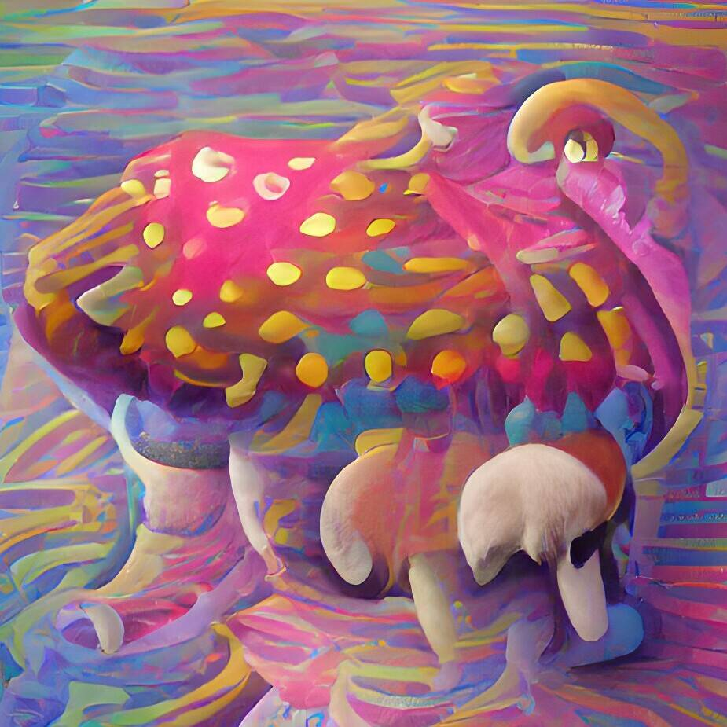

# Shroom Goons

300 件人工 AI 生成的艺术作品，旨在让您旅行。 Shroom goons 兼具验证您绊倒 BALLS 的作用，并且是所有未来收藏的门票。

Shroom Goons NFT - 常见问题（FAQ）
▶ 什么是 Shroom Goons？
Shroom Goons 是一个 NFT（非同质代币）集合。 存储在区块链上的数字艺术品集合。
▶ 有多少个 Shroom Goons 代币？
总共有 300 个 Shroom Goons NFT。 目前，173 位所有者的钱包中至少有一个 Shroom Goons NTF。
▶ 最近卖出了多少个 Shroom Goons？
过去 30 天内售出 0 个 Shroom Goons NFT。
▶ 什么是流行的 Shroom Goons 替代品？
许多拥有 Shroom Goons NFT 的用户还拥有 Smiling Humans Club、OWL-MY-BABIES、Tax Extension 和 My Shower Diaries。

