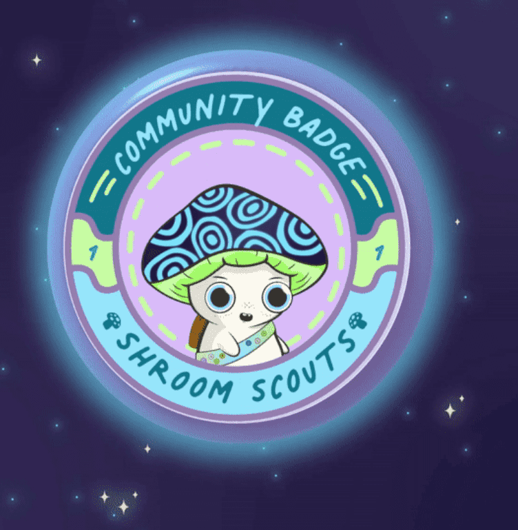

# Shroom Scouts

Shroom Scouts 是为追求这次冒险的 Magic Mushroom Clubhouse NFT 持有者收集的徽章。 这些徽章的拥有者拥有吹牛的权利、获得未来徽章的能力，以及在 Magic Mushroom Clubhouse 社区内的某些好处。 Shroom Scouts 的成立是为了将 NFT 的所有权游戏化，并与其他 MMC 成员建立信任和关系。 这是一个促进团队合作、参与和沟通的互动旅程。 将发布 5 种不同类型的徽章：社区徽章、营火徽章、慈善徽章、草料徽章和贵族徽章。获得这些徽章将变得更加困难，每个徽章将变得更加稀缺。这 5 个徽章按顺序列出 完成情况：(1) 社区徽章 (2) 篝火徽章 (3) 慈善徽章 (4) 牧草徽章 (5) 贵族徽章

魔法蘑菇俱乐部是一支由9，200名探险家组成的友好部队，他们正在清理生物元宇宙。他们通过传播蘑菇的古老力量，发现祖先的秘密并在此过程中帮助他人来获得冒险徽章。

