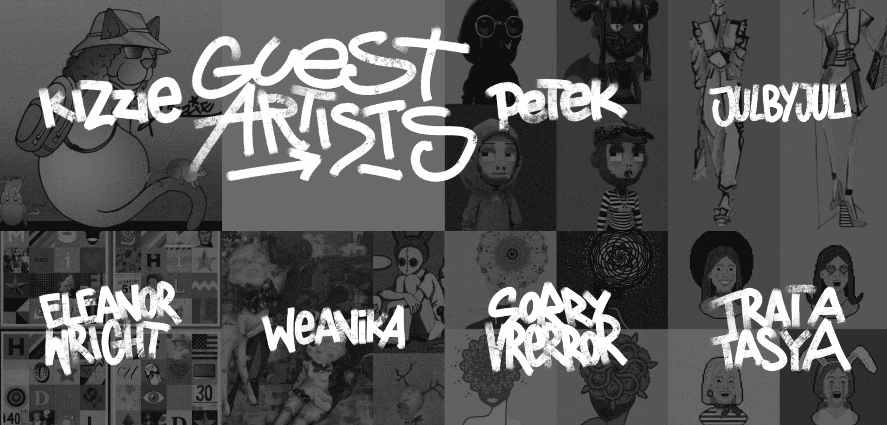

# Sicko Univese

**西科大学**

SICKO_UNIVERSE 是一个以社区为重点的衍生 NFT 集合，包含 9,999 个稀有 Nft。 每个 NFT 都是使用 140 多种属性（如帽子、眼睛、皮肤等等）的组合通过算法生成的！SICKO_UNIVERSE 在以太坊 (ETH) 区块链上推出，旨在以可承受的价格提供高质量的艺术品，同时执行广泛的路线图。

SANNAS 是 SANJAY 系列的同时代女性。 SANNAS 在各方面都与他同等（如果不是更优秀），是 3,000 个 PFP，其灵感来自我们在 NFT 领域最尊重的创意女士（以及：我们的母亲）。 SANNAS 完善了 SICKO Universe，SANNAS 作品将出现在 SICKO Universe 漫画中。

SICKO 首席艺术家 Alexander 和他的母亲（也是艺术家/插画家）之间的合作，该系列包含 7 位女性 NFT 艺术家，他们提交了 1/1、背景、沙盒化身和其他酷艺术！

