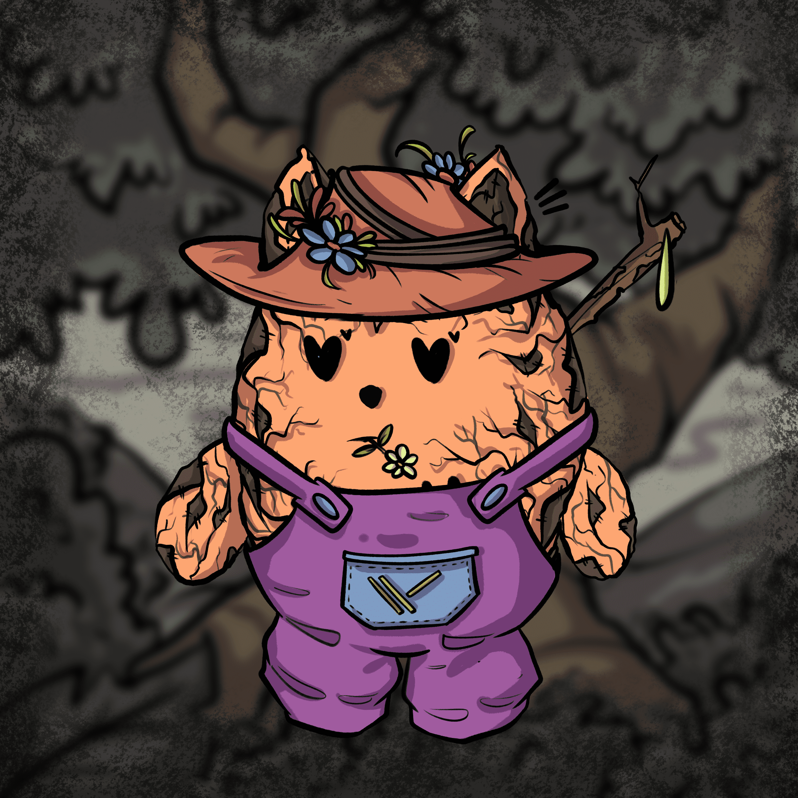

# Side Kicks By Loomi Heads

1930 年是动画片最好的时代之一。 我们的 Loomis 的灵感来自 30 年代的艺术风格，即“橡胶软管风格”，具有典型的 1930 年代松软和时髦的外观。 我们希望通过一点艺术气息将这种令人惊叹的艺术风格带回生活。 所有卢米人都住在卢米地。 众所周知，它们与这些称为 SideKicks 的生物交朋友。 有传言称 SideKick 是这个世界未来的关键。 这是开发由我们的创始人/艺术家 Rukshan AKA Coso 创建的世界的下一步。

卢米头Loomi Heads可能是1930年代最愚蠢的卡通人物集合！

它是以太坊区块链上存在的5，555个NFT的独特集合。Loomi Head是来自超过12个类别的300多种特征的组合。

每个Loomi都是唯一的，随机生成的，因为它们都有不同的项目。有12个类别和超过300 +资产，只是为了让你的loomi真棒！

