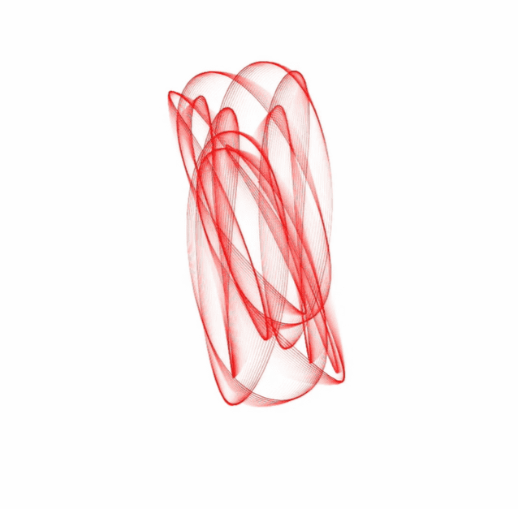

# signals - a direct experience

“信号”是一系列音频/视觉冥想。它完全是关于振动和关系。 谐波、泛音和听觉振动的相互作用直接转化为视觉表现，使体验者能够注意到声音中更微妙的细微差别。 提高对微妙振动的认识可以使您更深入地参与生活和周围的世界。与使用参考（符号）代表其他事物（所指）的语言和理性思维不同，声音可以被视为一种直接体验。 意义不是来自解释或翻译，而是来自直接体验和与振动本身的相互作用。世界是健全的。形式跟随频率。相互作用导致共振。一切“变得栩栩如生”作为关系的产物。直接参与世界 .存在是一种艺术形式。

