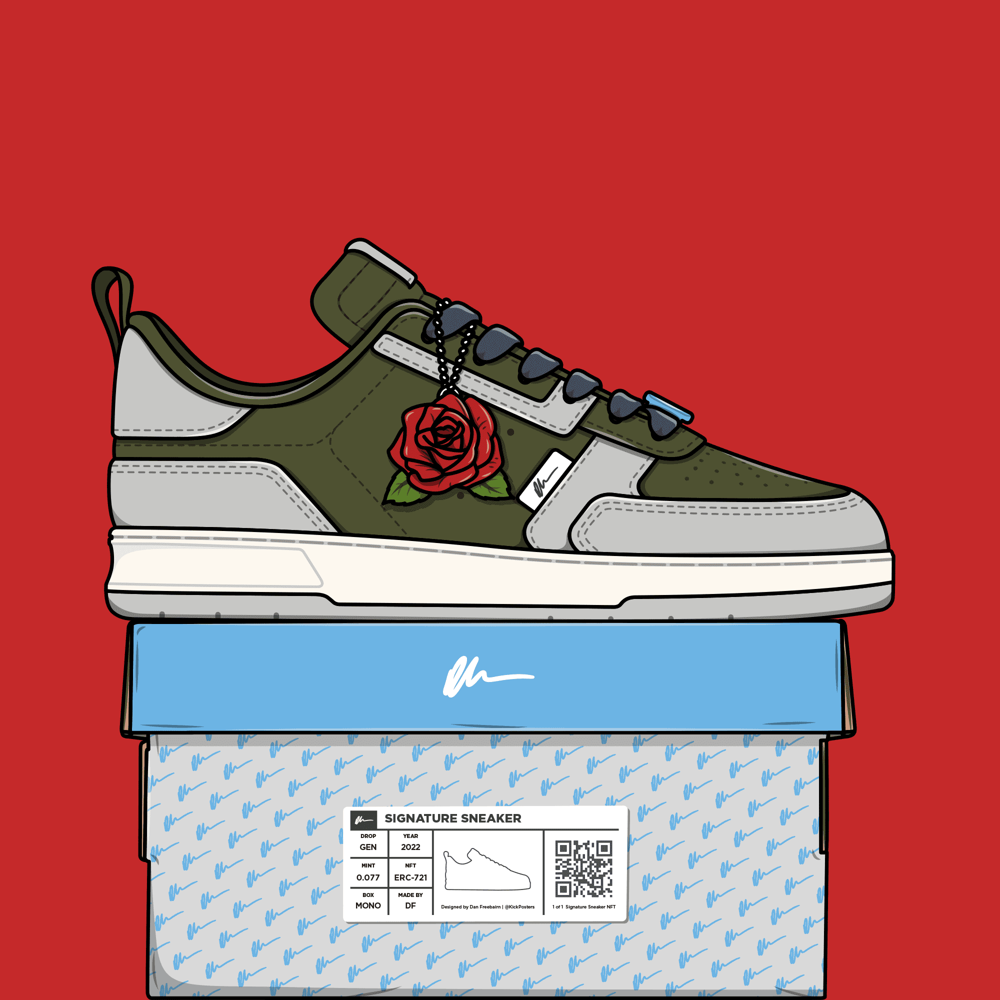

# Signature Sneakers Generative

Signature Sneakers 是由 Dan Freebairn（又名@KickPosters）创作的 777 幅运动鞋插图中的 1 幅的集合。Dan 是一名设计师和插画家，他在鞋类行业工作了 7 年以上，并且有幸与几位合作过 主要品牌包括阿迪达斯、彪马、锐步等。签名运动鞋采用 Dan 自己的运动鞋轮廓，可以在随机生成的配色中找到，使用 100 多种不同的特征。 单独插图的元素从熟悉的 NFT 特征和项目中汲取灵感，并参考了运动鞋场景和一些最受炒作的现实生活运动鞋。

Signature Sneakers是Dan Freebairn（又名@KickPosters）的运动鞋插图集。

Dan是一名设计师和插画家，已经在鞋类行业工作了7年多，并且很幸运地与几个主要品牌合作，包括adidas，Puma，Reebok等。

标志性的运动鞋具有Dan自己的运动鞋廓形，可以在随机生成的配色中找到，使用100多种不同的特征。单独插图的元素从熟悉的NFT特征和项目中汲取灵感，并参考了运动鞋场景和一些有史以来最被炒作的现实生活中运动鞋。

