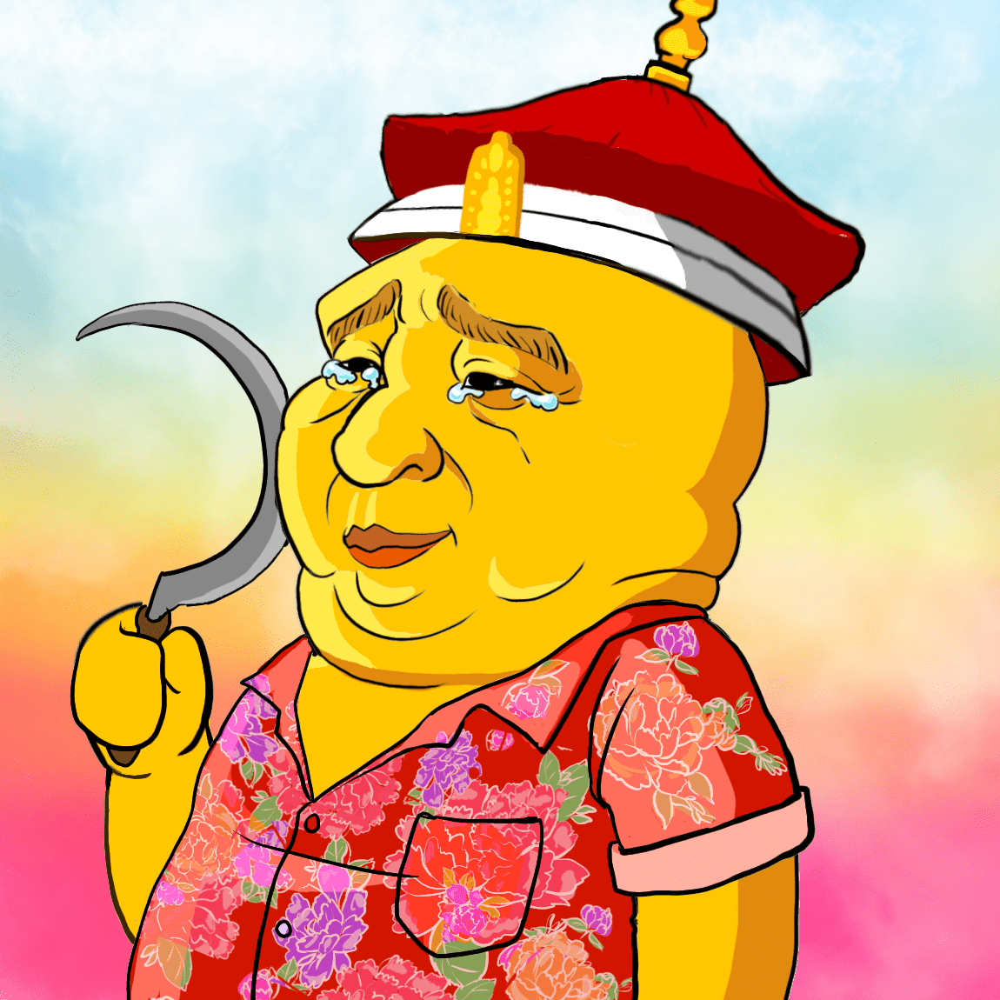

# Silly Old Bear

Silly Old Bear NFT 系列是“区块链自由”的声明，也是对世界上应该正确的事物的艺术荣誉徽章。 一群艺术家聚集在一起，创造了 100 多种对他们的生活具有深远意义的特征和特征，并象征着他们热情捍卫的自由。 在我们的网站上免费提供 Mint 1

在不远处的世界里，在《防火长城》的绯，住着一只“傻老熊”，害怕看到自己傻傻的倒影。熊非常害怕看到自己的“肖像”，以至于他试图通过强制对任何愚蠢的描绘进行绝对审查来吓唬森林王国中的所有其他动物，否则他们将不得不回应他的愤怒。

但所有其他动物都觉得这只是愚蠢的。“你怎么能剥夺我们基本的动物自由，傻老熊？你不能。最聰明的動物開始了解加密和NFT，並意識到有一個全新的王國，擺脫了傻老熊敏感的統治，充滿了世界上最美麗，最聰明的生物。

尤里卡！

为了确保没有动物会再被不公正的S.O.B.吓得沉默，他们以NFT的形式创建了10，000个声明片段，这些声明片段将被分散并分散在新以太坊王国周围。每个NFT都是“傻老熊”的艺术象征，提醒所有动物，言论自由超越一切边界......

新动物王国颁布法令：

“人人有权享有见解和言论自由;这项权利包括不受干涉地持有意见的自由，以及通过任何媒体和不分国界寻求、接受和传递信息和思想的自由。- （《世界人类动物权利宣言》第19条）

这个前沿就是现在。

