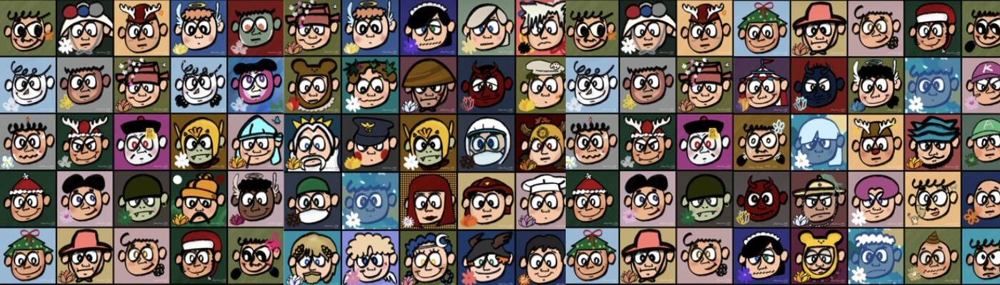

# ART of KLAY_SIMFLOWER #999

**特征**
欢迎来到SIMFLOWER 社交俱乐部
999 个简单而有吸引力的 Simflower 的集合构成了 JoungJoungyeop 集体供您使用、购买、保存和交易。

Joungjoung yeop 是韩国新数码画家。 在开始制作<Simple Flower #999>系列时，他正在Metabus上建立自己的世界观。

 简单的画面风格和他处理的颜色在 Metabus 上引起了极大的关注。

“空白”是他作品的一大亮点，海军蓝和橙色是他的标志性颜色。

**路线图**
可持续增长以及对持有人的各种好处10%
我们计划运营一个新的沟通渠道。

只有 999 件艺术品可供公众铸币厂使用，并让会员有机会参与其中。

60%
我们的故事从未停止。

我们的 NFT 将不仅仅是您钱包中的数字图像。 并且所有这些都将使我们的 SIMflower 持有者受益于原始收藏。

将举行线上/线下活动和空投活动。

第 1 阶段：启动启动。

我们的第一要务是尽可能提供迷人的 NFT。 这些都是艺术家亲手创作的作品，每件作品只有一件。

