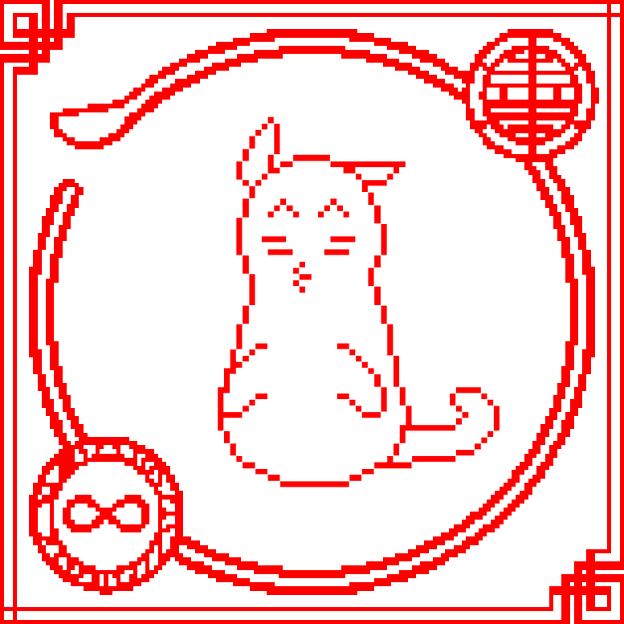

# Sinan Kitty

作为中国新年！！！虎年即将来临（2022 年 2 月 1 日，UTC+8）。为了庆祝和回馈凹坑社区的所有伟大工作，我们来自华人社区的团队制作了这些 NFT，希望它们能给大家带来虎年好运、身体健康、财源广进.
所有功能均由具有开源代码的算法生成。至于 NFT 的风格，我们从中国传统艺术品中找到了一些灵感：CNY 装饰品/纸艺。它们经常贴在家里的窗户上，以庆祝一些特殊的节日或活动。在那些 NFT 中，我们尝试通过风格迁移算法来模拟它们的风格，并结合了一些勺子元素。
同时，在画面的中下方是四个汉字“新”、“年”、“快”和“乐”，中文意思是“新年快乐”。
凹面将在 2022 年飙升。WAGMI !!!

