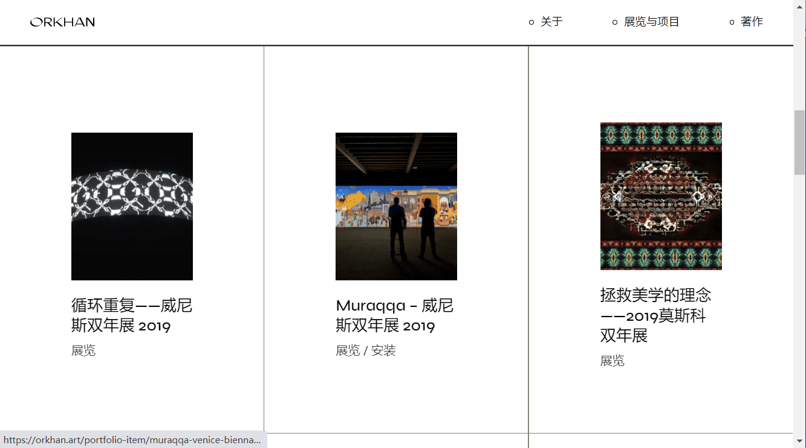

# Singularity in Heritage

我的实践过程涉及使用数字制造工具和模拟数据，因为它探索了与更广泛的城市环境相反的中东个体的对比发展和文化历史。
美学沉浸式展览 的复兴
随着数字时代的兴起，将过去融入未来的重要性对于拯救我们的遗产免于消失至关重要。Orkhan Mammadov 的艺术展《美学复兴》致力于再现中东文化历史，以确保未来与过去、反乌托邦与乌托邦之间的对话。 2022 年 3 月 12 日至 5 月 12 日

在数字艺术剧院展出

