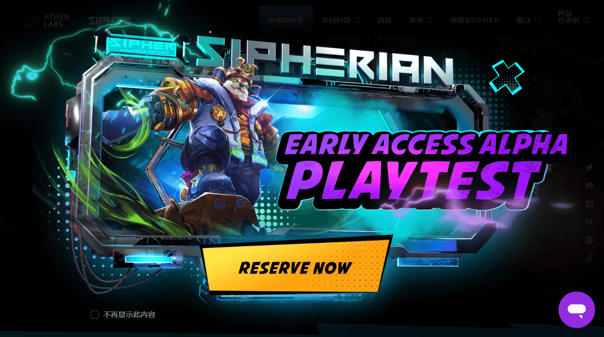

# Sipher Spaceship Lootbox

什么是 SIPHER？
SIPHER 是一款雄心勃勃的休闲格斗和探索游戏，其最终目标是创建一个开放世界的社交体验，所有这些都建立在以太坊区块链上。玩家驱动的经济

Sipherian Odyssey 允许玩家购买、交易、获取和出售商品和物品，作为其游戏玩法的核心元素。Sipheria 的多个世界中的每一个都有独特的有限资源分布，所有这些都可以在深度制作系统中收集和使用。您可以消耗您从其他玩家那里收集或购买的资源来制作设备并出售您创造的物品以增加您的财富，让玩家推动游戏内经济的状态。

