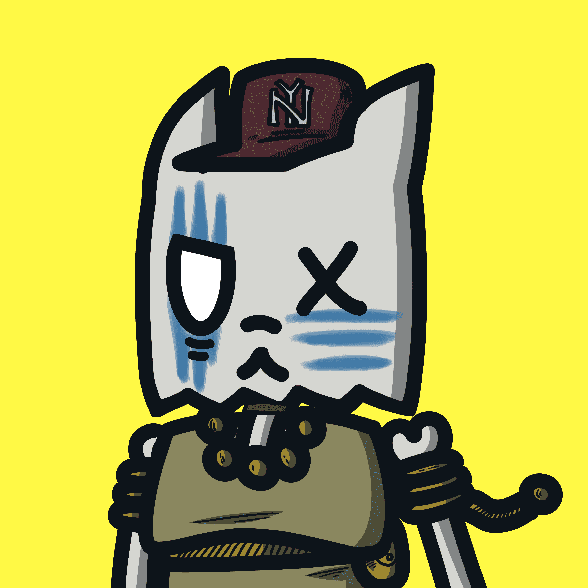

# Skeletal Cats Official

发现一个稀有的收藏的骨骼猫
骷髅猫不仅仅是一件很酷的艺术品。拥有一只骨骼猫会让您成为我们社区骨骼小队的一员。Skeletal Cats 是一个社区驱动的项目，所筹集的大部分加密货币将重新投资于我们 NFT 带来的宝贵特权和好处。

所有的猫都以 9 条生命开始。每一次重生都让他们离死亡更近一点。一旦一只猫经历了 8 次生命，它们要么被允许进入天堂，要么掉入深渊。不屈不挠的猫，反抗规范的不法之徒，被扔到深渊，重生为骷髅猫。Skeletal Cats 是 3,333 个独特的、随机生成的 NFT 的集合，它们存在于以太坊区块链上。每只骷髅猫都是独一无二的，由 180 多种可能的特征、脸型、头饰、服装等生成。

‍
