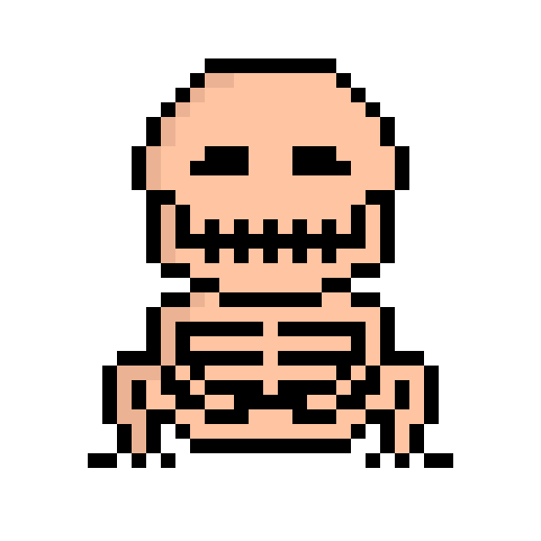

# Skeleton-Bit

啃食在棚子里创造了比特。我们不知道怎么做，也不知道为什么。人们曾多次尝试潜入棚子里，看到神秘的Nibbles和他的作品，但都失败了。迄今为止，与所谓的“Build-A-Byte项目”有关的所有信息都来自埋藏在棚子后面的一堆垃圾中发现的多个文档。从这些文件中恢复的信息可以在下面找到。

第三台机器被认为是“字节生成器”。我们的理解是，这台机器以某种方式将比特组合在一起，形成字节。在恢复的文件中已经提到，在某个时候，这台机器将向公众开放。短语“Build-A-Byte Factory”在整个文档中多次出现。我们相信字节构建器和Build-A-Byte Factory以某种方式联系在一起，但尚未制定明确的理论。

这是我们目前在调查过程中拥有或愿意与公众分享的所有信息。当新信息出现时，我们将更新此页面以及我们的DISCORD和TWITTER。垃圾日即将到来，因此我们预计不久将有更多有关Nibbles总体规划的信息......

