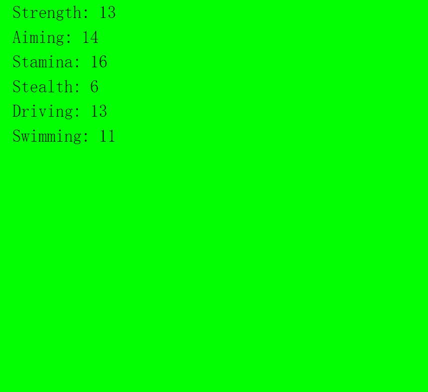

# Skill Stats (not for Weaks)

经过73E7F7
基本上是不值钱的。 但如果……怎么办？

它基本上是毫无价值的。但是，如果...呢？

技能统计（不适用于弱者） NFT - 常见问题（FAQ）
▶ 什么是技能属性（不适用于弱者）？
技能统计（不适用于弱者）是一个NFT（不可替代令牌）集合。存储在区块链上的数字艺术品的集合。
▶ 有多少技能属性（不适用于弱者）代币存在？
总共有5，862个技能统计数据（不适用于弱者）NFT.目前，2，822个所有者在他们的钱包中至少有一个技能统计数据（不是弱者）。
▶ 最近卖出了多少技能属性（不是弱者）？
在过去30天内售出了0个技能统计（不适用于弱者）NFT。

