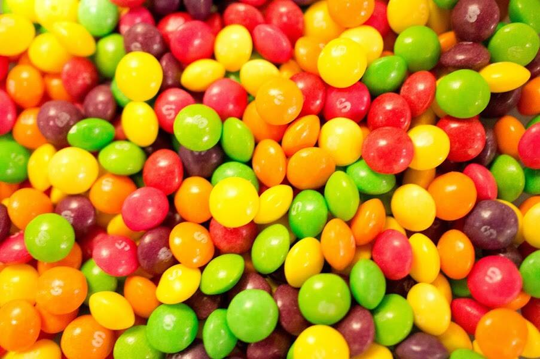

# Skits (for Jay Pegs Auto Mart)

第1阶段：保留您的钥匙
通过在 MISO（Sushi 的代币销售平台）上购买 $DONA 预留代币来预留您的钥匙。味噌特卖将于 9 月 13 日美国东部标准时间 12 点开始。此次销售将是 ERC20 代币的批量拍卖：1 $DONA = 1 2007 Kia Sedona NFT。这些交易不会持久。
第2阶段：标志和驾驶
每个 $DONA 预留代币都可以使用特殊合约在 9 月 21 日开盘时将您的 ERC20 兑换为 2007 年起亚 Sedona NFT。只有 $DONA 持有者才有资格在该地段进行交易 - NFT 将随机抽取 - 先到先得。
第三阶段：转售价值
Jay Pegs 销售团队将完成您的文书工作，以确定这些车辆的稀有性。稀有度将在此时揭晓，以便客户了解这里所发挥的非凡和真正独特的品质。
第4阶段：路线图
在 Jay Pegs Auto Mart，我们将过去推向未来。伙计们，这一切都从你开始。当所有车辆都离开停车场时，夏季销售马拉松结束了。耶稣，带上方向盘。

