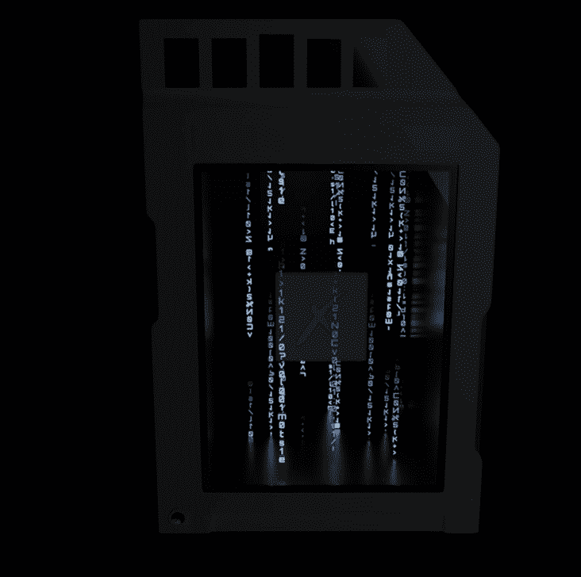

# Skorge Alpha Key

Skorge Alpha Gang 是一个社区，研究和识别最热门的新 NFT 项目，并与成员分享有关这些项目的信息。 我们进行所有艰苦的工作和研究，以确定高质量项目的关键指标。 这意味着为您提供更少的磨削和更多的机会。

什么是 Skorge Alpha Key？
Skorge Alpha Key是一个NFT（不可替代令牌）集合。存储在区块链上的数字艺术品的集合。
▶ 有多少个 Skorge Alpha Key 代币存在？
总共有974个Skorge Alpha Key NFT.目前有749个所有者在他们的钱包中至少有一个Skorge Alpha Key NTF。
▶ Skorge Alpha Key最昂贵的销售是什么？
出售的最昂贵的Skorge Alpha Key NFT是Alpha Key #399。它在 2022-06-07 （3 月 前） 以 $28.8 的价格出售。
▶ 最近卖了多少个Skorge Alpha Key？
在过去的30天内，售出了4个Skorge Alpha Key NFT。
▶ 什么是流行的 Skorge Alpha Key 替代品？
许多拥有Skorge Alpha Key NFT的用户也拥有Skorge Elysium Key，Noox Genesis Pass Tier 2，End of Days：Ragnarok Collectibles和NooneNFT。

