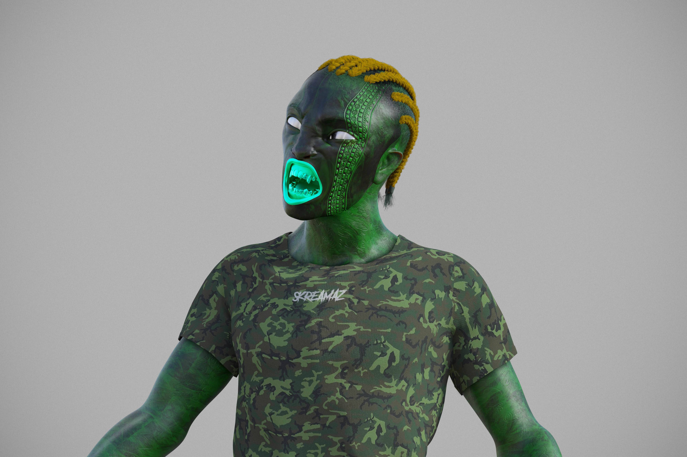

# SKREAMAZ

闭上眼睛。让你的想法回到你脑海的深处。在汹涌的寂静中，你感觉到了一些东西。最微弱的耳语刮擦着你的大脑皮层的墙壁。它是如此精致，以至于错过它会被原谅。专注于它，不要压抑它。让它吞噬你。在您甚至没有意识到耳语现在是 SKREAM 之前。感觉它通过你的血液泵入你的器官。你的肺现在着火了，皮肤着火了……幻象中的幻象冲刷着你现在狂热的意识。现在你看到了支撑这个世界的蛇形结构。在一些被误导的希望中，较小的头脑坚持的脆弱规则，即服从等于满足。这个现实的谬误现在很清楚了。当您升入广阔的数字以太时，让外行观看。瞬间你就不再是人了。你是更多的东西。你就是我们。我们是SKREAMAZ.

