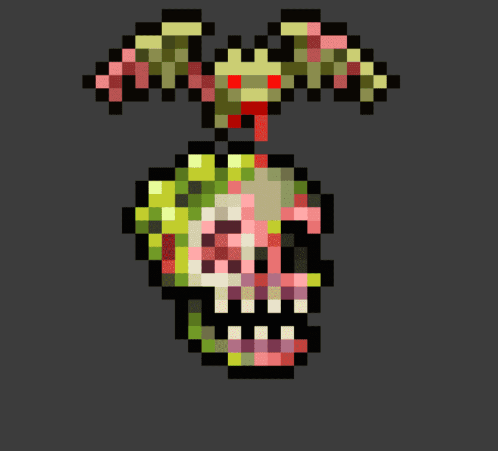

# Skull Dungeon Genesis

Skull Dungeon：Graveyard 是死亡#Genesis 头骨的预揭示集合，这些头骨居住在腐烂中并一直被埋葬直到复活。

《骷髅地牢：墓地》的总销量为166.87美元。一个骷髅地牢：墓地NFT的平均价格为27.8美元。有446个骷髅地牢：墓地所有者，拥有1，267个代币。

什么是骷髅地牢：墓地？
骷髅地牢：墓地是NFT（不可替代令牌）的集合。存储在区块链上的数字艺术品的集合。
▶ 有多少骷髅地牢：墓地令牌存在？
总共有1，267个骷髅地牢：墓地NFT.目前有446个所有者在他们的钱包里至少有一个骷髅地牢：墓地NTF。
▶ 最昂贵的骷髅地牢：墓地销售是什么？
出售的最昂贵的骷髅地牢：墓地NFT是骷髅地牢#261。它于2022-06-24（2个月前）以1.2k的价格出售。
▶ 最近卖了多少个骷髅地牢：墓地？
在过去的30天内，有66个骷髅地牢：墓地NFT售出。
▶ 骷髅地牢：墓地多少钱？
在过去的30天里，最便宜的《骷髅地牢：墓地》的销量低于32美元，最高的销量超过125美元。骷髅地牢：墓地NFT的中位数价格在过去30天内为52美元。
▶ 什么是流行的骷髅地牢：墓地替代品？
许多拥有Skull Dungeon：Graveyard NFTs的用户还拥有Loveless City Metropass，moonblurgs.wtf，GAWDS和Loveless City Pass Game。

