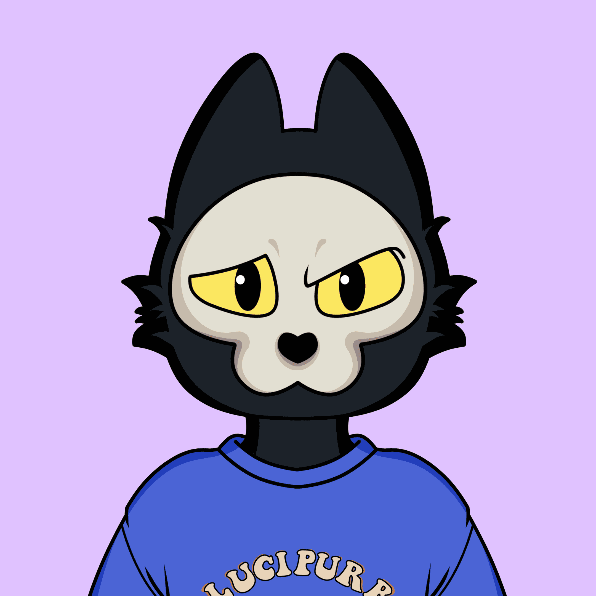

# Skull Kitties

骷髅猫统计
创建于大约 1 年前
536 代币供应
2.5% 费用
过去 7 天内没有出售任何骷髅小猫。

Skull Kitties 是 9999 只从地狱中长大的可爱小猫的集合。它们是独一无二的，随机生成的，目前在以太坊区块链上过着他们的第 9 生命。💀🐱,

▶ 什么是骷髅猫？
Skull Kitties 是一个 NFT（不可替代令牌）集合。存储在区块链上的数字艺术品集合。
▶ 有多少个 Skull Kitties 代币？
总共有 536 个 Skull Kitties NFT。目前，151 位所有者的钱包中至少有一只 Skull Kitties NTF。
▶ 最近卖出了多少只骷髅猫？
过去 30 天内共售出 0 个 Skull Kitties NFT。

