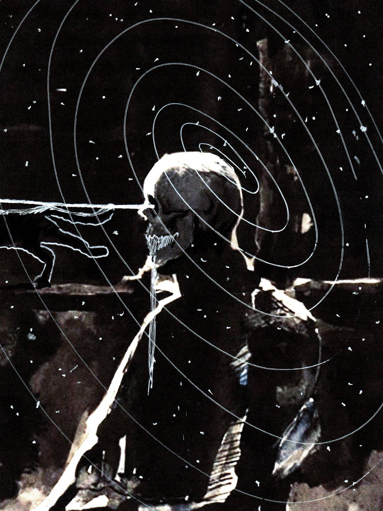

# Skull Study The Crown Series

头骨研究皇冠系列统计
创建于 6 个月前
6 代币供应
10% 费用
过去 7 天内没有售出 Skull Study The Crown 系列。

用霓虹色和激光束破坏完美的皇室头骨
Skull Study The Crown 系列 NFT - 常见问题（FAQ）
▶ 什么是皇冠系列头骨研究？
Skull Study The Crown 系列是一个 NFT（不可替代代币）系列。存储在区块链上的数字艺术品集合。
▶ 有多少 Skull Study The Crown 系列代币？
总共有 6 个 Skull Study The Crown 系列 NFT。目前 6 位所有者的钱包中至少有一个 Skull Study The Crown 系列 NTF。
▶ Skull Study The Crown 系列最近卖出了多少？
过去 30 天共售出 0 个 Skull Study The Crown 系列 NFT。

