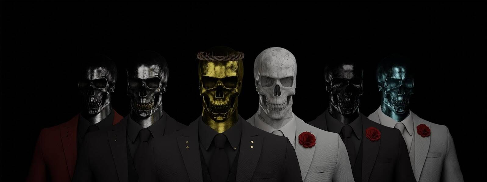

# SkullFellas: Family First

SkullFellas – 一个连接良好的 NFT 集合。我们是 5,555 个独特的 3D 雕刻、逼真纹理和随机生成的 SkullFellas——一个 1900 年代早期的犯罪家族，从我们的骨灰中复活，我们现在作为 ERC-721 代币生活在以太坊区块链上。

有 410 多个现实特征分布在 12 个特征类别中。

▶ 什么是 SkullFellas：家庭至上？
SkullFellas: Family First 是一个 NFT（非同质代币）集合。存储在区块链上的数字艺术品集合。
▶ 存在多少 SkullFellas: Family First 代币？
总共有 229 个 SkullFellas：Family First NFT。目前，136 位所有者的钱包中至少有一个 SkullFellas: Family First NTF。
▶ 最近卖出了多少 SkullFellas: Family First？
过去 30 天内售出了 0 个 SkullFellas: Family First NFT。

