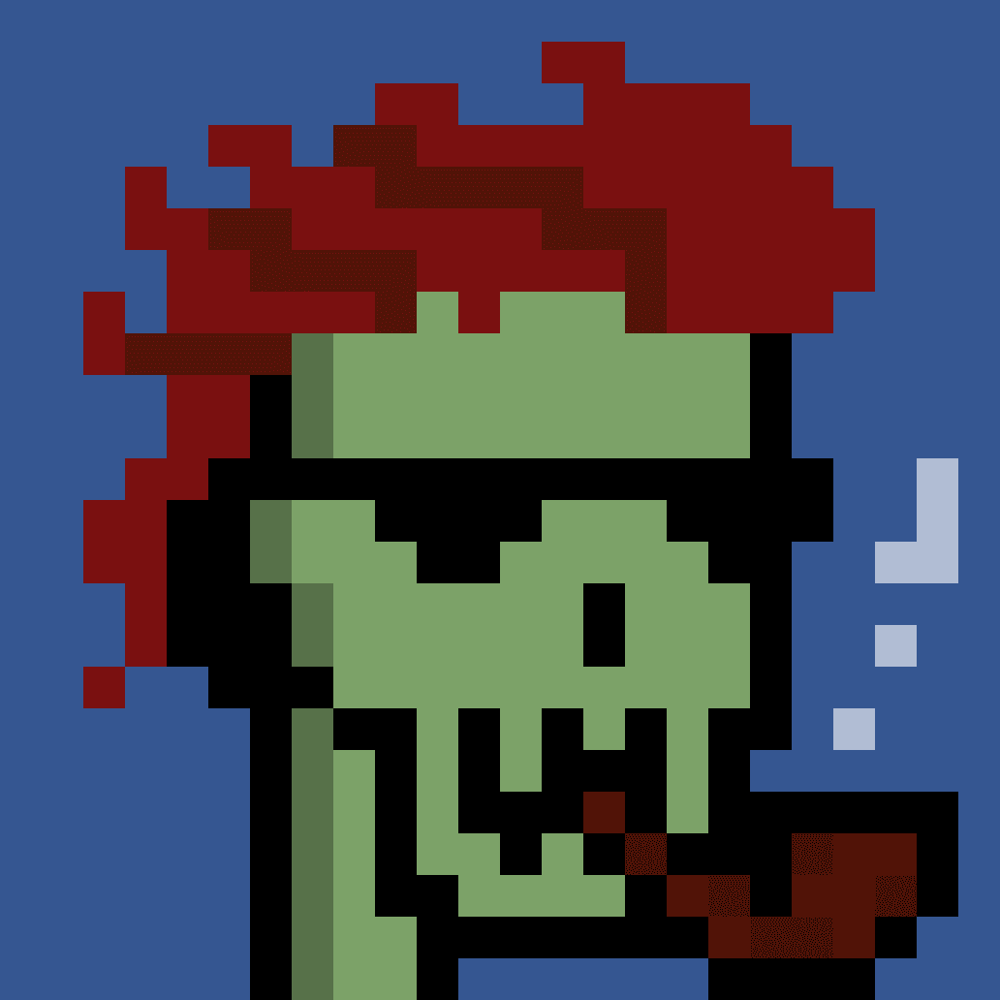

# skullies.club

免费薄荷
10,000 个时髦的头骨生活在以太坊区块链上。

由一群野心勃勃的 web 2.0 开发人员开发，Skullies Club 是他们在 web 3.0 世界中的第一个项目！

你可以发现他们在通常的地方闲逛......1.它是免费的！
你不喜欢免费的狗屎吗？

2.他们很酷！
睁开眼吧兄弟

3.你可以得到更多的免费狗屎
我们将向持有者赠送一些神秘的 NFT！

就像，很酷吧？

100% 薄荷
神秘 NFT 送出！
4.获取MoonLabs产品！
您可以免费使用MoonLabs工具。

该团队旨在构建一些有用的 NFT 工具，帮助您研究、分析并最终从 NFT 交易中获利！

稀有物品
每个头骨都有不同的特征！每个功能都有不同的稀有度！您的头骨特征越稀有，等级就越高！

