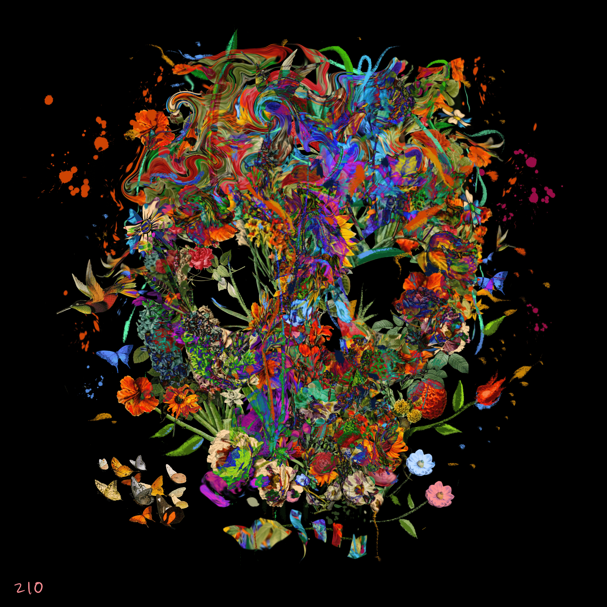

# SKULLIES GMI

元宇宙中最新鲜的头骨！ 音乐、艺术、游戏、社区和对生成艺术的全新演绎🎲🎲💀 ProbCause 将有 666 个手绘 1/1 骷髅头。 这些特征是通过对属性图表滚动一对骰子来生成的。 每个 SKULLY 都是独一无二的，可以访问空投、游戏、赠品、独家商品、音乐等。 🚨 SKULLIES 在多个 SKULLIES 的波中释放，或者在 SKULLIES discord 中作为隐形掉落。 还将与 NFT 领域的一些最大艺术家进行 33 次 SKULLY 合作拍卖。☠️ 当前进度 215/666 个 SKULLIES 已被召唤。加入 Discord 和 Twitter 上的 SKULLY 社区以获取更新并尝试捕捉最新掉落 ！ 每月 1 日发布新的掉落和活动时间表。

