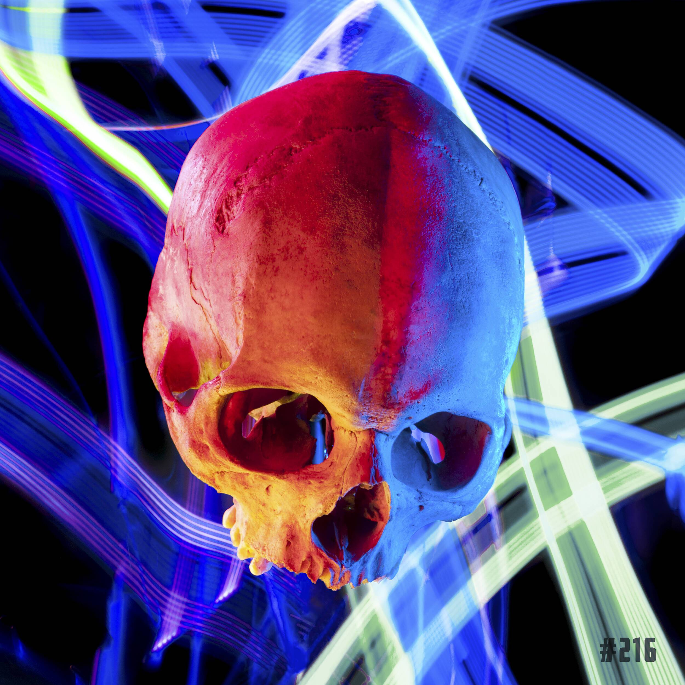

# Skulls On ETH

SkullsOnETH 是一个持续 10 年的 NFT 艺术项目，始于两位艺术家环游欧洲寻找真正的头骨。现在是这些头骨重生的时候了。365幅作品分为6个章节。真正的艺术家，真正的艺术——独特的旅程。
您自己的创世纪头骨的艺术印刷品，包括创始人的亲笔签名
每个额外的 pfp 收藏 2 个免费薄荷糖
访问 Hellraiser 部分（项目分析、一般市场更新、竞赛、愉快的对话等等）
免费参加所有国企的真实活动
每周将公布更多福利

