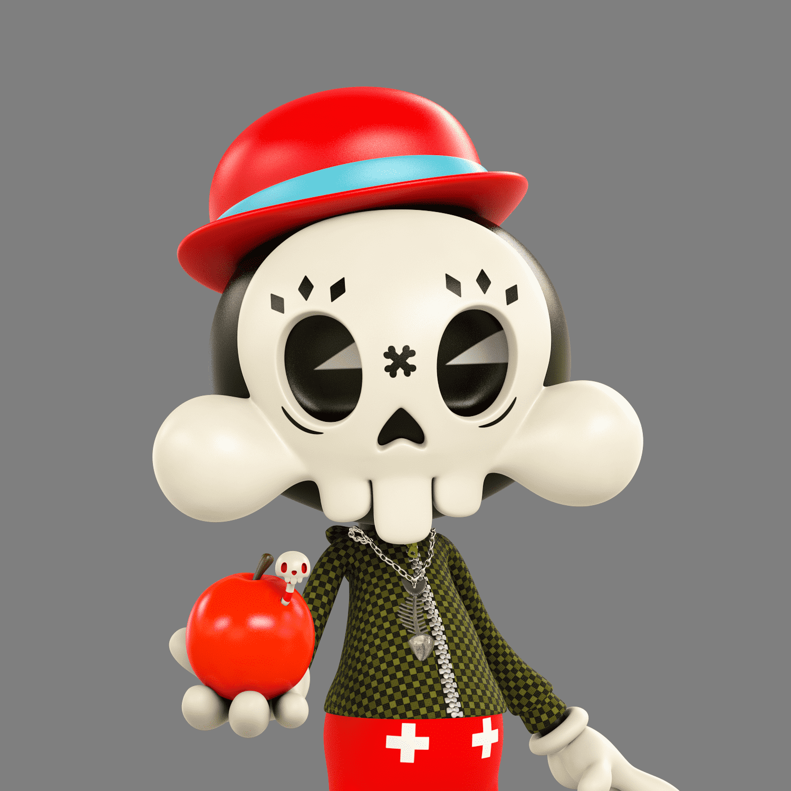

# SKULLTOONS Gavroche by Theodoru

Skull Society 由 7,777 个头骨组成，由著名的新波普艺术家 Theodoru Badiu 以独特的手绘特征组成，隐秘而独特。 该系列向“Gavroche”致敬。 这个可爱的角色非常聪明，充满街头智慧，反映了我们所有人的一部分：在人类体验之旅中复杂的情感融合。这些不是普通的头骨。 每件艺术品都反映了 Theodoru 的信念，即无论现实如何可怕，我们都可以成为希望的支柱。

骷髅协会笼罩在秘密之中，散发着排他性，是一个由7，777个骷髅组成的团体，具有着名的新流行艺术家Teodoru Badiu的独特手绘特征。

这个系列向“Gavroche”致敬。这个可爱的角色非常聪明，充满了街头智慧，反映了我们所有人的一部分：在人类经历的旅行中情感的复杂融合。

这些不是普通的头骨。每件艺术品都反映了Teodoru的信念，即无论现实的可怕之处如何，我们都可以成为希望的支柱。

