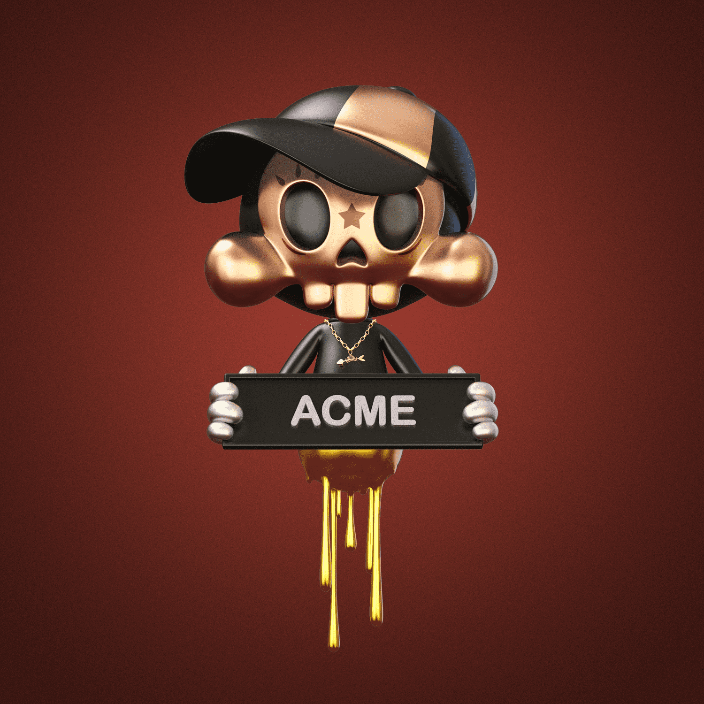

# SKULLTOONS Genesis by Theodoru

Skull Society 由 1,777 个头骨组成，由著名的新波普艺术家 Theodoru Badiu 以独特的手绘特征组成，隐秘而独特。该系列向“Gavroche”致敬。这个可爱的角色非常聪明，充满街头智慧，反映了我们所有人的一部分：在人类体验之旅中复杂的情感融合。这些不是你的平均头骨。每件艺术品都反映了 Theodoru 的信念，即无论现实如何可怕，我们都可以成为希望的支柱。

我们 SKULLYLIST 的所有成员将有 6 小时的时间来铸造一个 SKULLTOONS NFT。6 小时结束后，任何人和每个人都可以在我们的公开发售中进行铸币，每个钱包最多可以铸币 3 个 NFT。铸币后 77 小时，持有者将能够召唤他们独特的 Gavroche 并崇拜 Theodoru 的创作。

