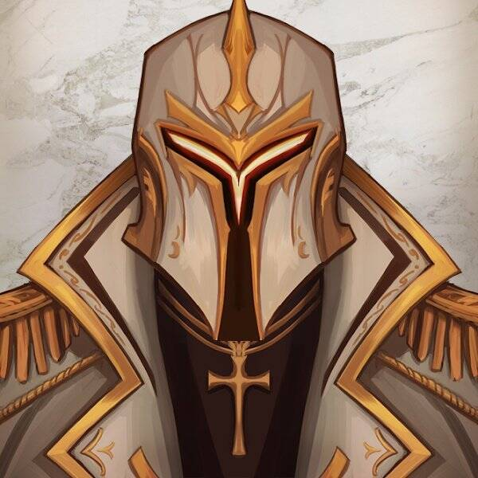

# Skullx: Creatures & Artifacts

Skullx 是 10,000 个头骨的集合，这些头骨来自 9 个不同的领域，具有自己独特的特征和设计。在以太坊区块链上作为 ERC-721 代币被召唤。Skullx 持有者可以参加仅限持有者的抽奖活动和活动。
Skullx: Origins (KinkySkullx) 是我们的 666 像素头骨创世纪系列。这些像素是来自 Soh 的 1/1 手绘艺术品。这些将出现在未来的项目中，并且所有者可以访问独家内容，例如不和谐频道、抽奖和活动。
Aeons 是 Skullx 的 2,000 个 NFT 伴侣，他们来自同一个领域，并添加了 Nether 领域。下界试图统治骷髅界，是我们宇宙的邪恶虚空。

匹配来自同一领域的 Skullx 和 Aeon 将允许持有者融合这两个 NFT，以创建更稀有的 Fused Skullx NFT。

Aeon 将被烧毁，减少它们的供应。但是，您的 Skullx 将保留，您将获得两者的融合。由于只有 2,000 个 Aeons 但 10,000 个 Skullx，因此 Fusion 仅适用于有限数量的持有者。

