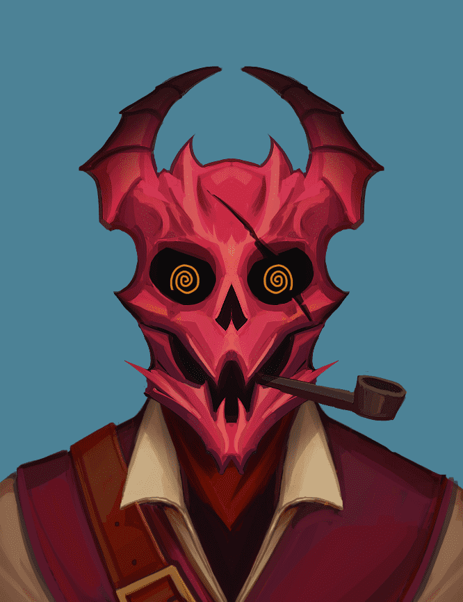

# Skullx

Skullx 是 10,000 个头骨的集合，这些头骨来自 9 个不同的领域，具有自己独特的特征和设计。 在以太坊区块链上作为 ERC-721 代币被召唤。

Skullx是来自9个不同领域的10，000个头骨的集合，具有自己独特的特征和设计。在以太坊区块链上作为ERC-721令牌调用。Skullx持有者只能参加持有者的抽奖和活动。

Skullx： Origins （KinkySkullx） 是我们 666 像素头骨的创世集合。这些像素是来自Soh的手绘1/1艺术作品。这些将出现在未来的项目中，所有者可以访问独家内容，例如不和谐频道，抽奖和活动。

