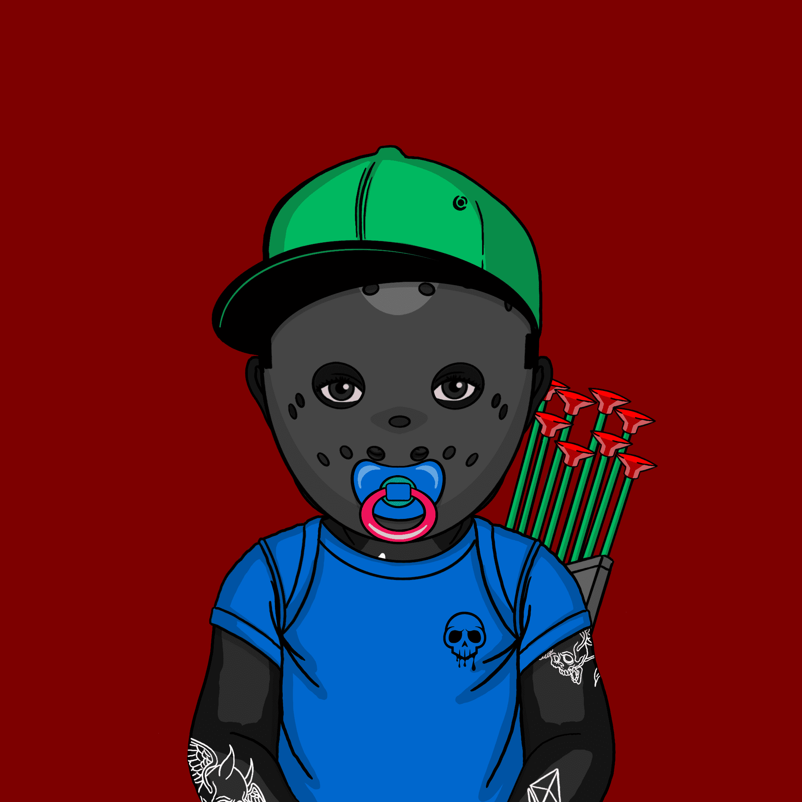

# Skvllpvnkz Daycare

Skvllpvnkz：10,000 个机器生成的头像 NFT的交互式集合
凭借区块链的变革力量和对去中心化未来的共同愿景，一个由艺术家、编码人员和不合适的人组成的专门团队发起了 Skvllpvnkz。

存储在以太坊区块链上的复杂计算机算法被用来创建 10,000 个独特的字符，所有字符都具有独特的特征。超过 350 层精心编制的手绘层被缝合在一起并通过机器送入。艺术和代码之间的界限被质疑、弯曲，然后被打破。

