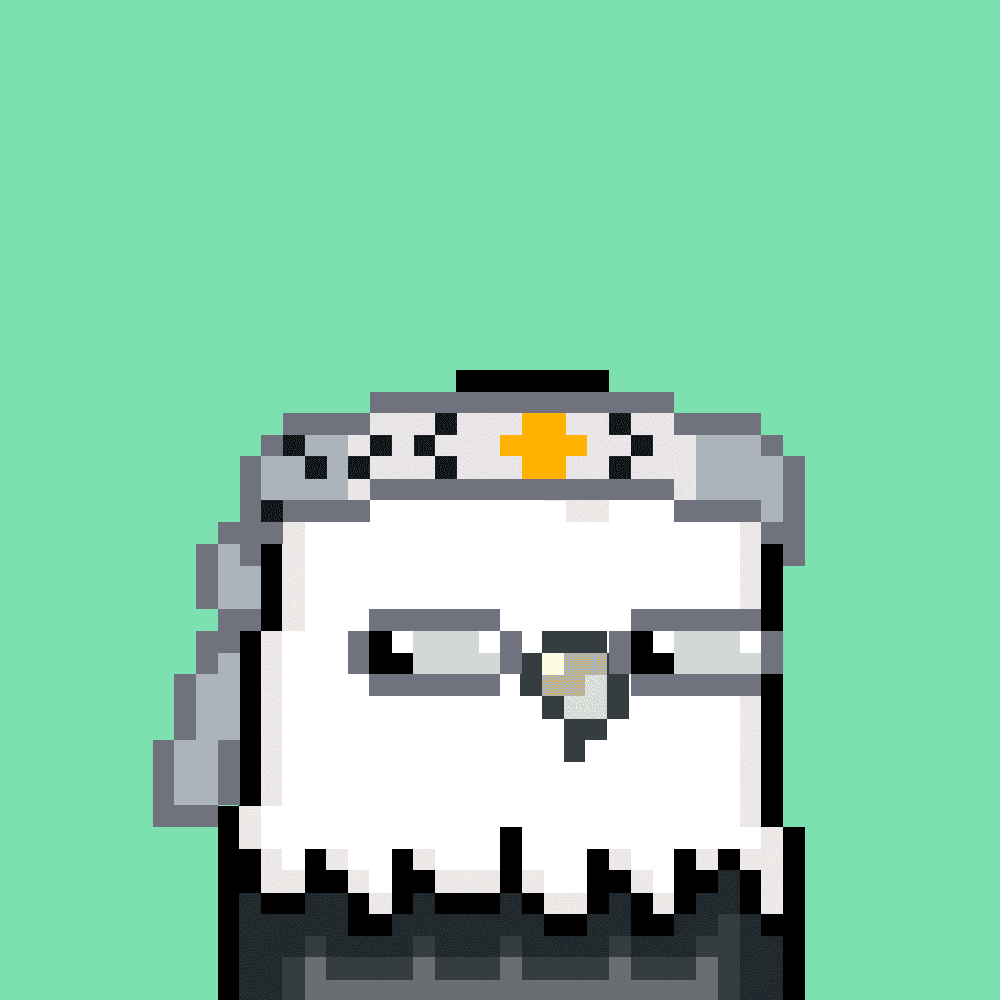

# Skybirds NFT

天鸟只是一个化身
它们是 5000 个未启用实用程序的 PFP 的集合，这些 PFP 具有多样性差且非独特的稀有特性池。
更重要的是，每只 Skybird 都会解锁公共俱乐部会员资格，并且持有的时间越长，福利就越少。
我们称之为反嵌套——因为，很明显。
一个以非实用程序和模因为基础的集合
在 FOORP，我们对考虑实用性的建筑并不陌生。这就是为什么每只 Skybird 也是您进入我们公共 FOORP Discord 的关键——您可以在其中进入我们的门控 Memes 频道。

进入后，您将可以非独家访问与 Skybird 相关的掉落、Memes 聚会和 Metaverse 活动，以及访问不存在的即将到来的 FOORP 项目；包括代号为 Project Skyrise 的 FOORP 元节。

