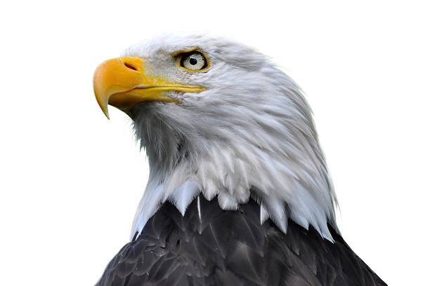

# Skyhawks

天鹰队数据
创建于 4 个月前
5 代币供应
1% 费用
过去 7 天没有售出 Skyhawks。

通常被称为鱼鹰，这些是亲眼目睹的真正令人敬畏的掠食者。
Skyhawks NFT - 常见问题（FAQ）
▶ 什么是天鹰？
Skyhawks 是一个 NFT（不可替代代币）集合。存储在区块链上的数字艺术品集合。
▶ 有多少 Skyhawks 代币？
总共有 5 个 Skyhawks NFT。目前 3 位所有者的钱包中至少有一个 Skyhawks NTF。
▶ 最近卖出了多少天鹰？
过去 30 天内售出 0 个 Skyhawks NFT。

