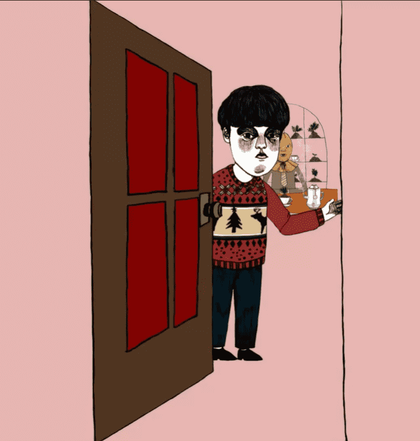

# SLEEP EXHIBITION

SLEEP EXHIBITION 是由 Sion、Mommyson、Chanju、Zior Park 和 Wonstein 制作的 6 种不同音乐 NFT 的集合。 对于任何在快节奏、疲惫的现代生活中挣扎的人，请访问 esionmusic.com，让 SLEEP EXHIBITION 与您交谈。 “太阳升起，睡个好觉。”

SLEEP EXHIBITION的总销售额为5.47万美元。一个睡眠展览NFT的平均价格为107.4美元。有1，083个睡眠展览所有者，总共拥有6个代币供应。

什么是睡眠展览？
睡眠展览是NFT（不可替代令牌）的集合。存储在区块链上的数字艺术品的集合。
▶ 有多少睡眠展览代币存在？
目前，共有6个睡眠展览NFT.目前有1，083名所有者的钱包中至少有一个睡眠展览NTF。
▶ 睡眠展览销售最贵的是什么？
NFT出售的最昂贵的睡眠展览是#4 Zior Park&Wonstein's Theme。它在2022-06-06（3个月前）以$ 707.4的价格出售。
▶ 最近卖了多少睡眠展？
在过去的30天内，有220个睡眠展览NFT售出。
▶ 睡眠展览的费用是多少？
在过去的30天里，最便宜的SLEEP EXHIBITION NFT销售额低于86美元，最高销售额超过257美元。睡眠展览NFT的中位数价格是过去30天内的120美元。
▶ 什么是流行的睡眠展览替代品？
许多拥有SLEEP EXHIBITION NFT的用户也拥有GENE_SIS：The Girls of Armament，Mental Health by Han，PXN：Ghost Division和Last Essence Official。

