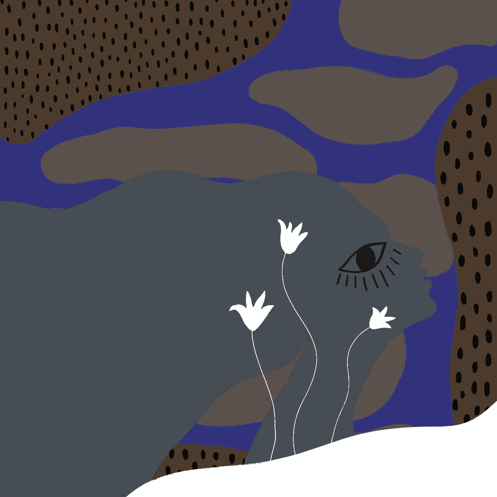

# Sleepwalkers NFT

梦是意识与潜意识相遇的体验。经常不舒服，有时很神奇，这种状态对我来说一直是我渴望探索的状态。我相信在我们非醒着的时间里，头脑是强大的，并且经常在工作。对我来说，感觉就像梦境是一个治愈未解决创伤的地方，也是创造力、流动和宁静的发源地。

我的第一个系列，梦游者，让我有意识地走过那些只存在于我梦中的不适、美丽和神秘的经历。我选择了 8,888 件作品来反映无限符号；永远出现在我的梦想和冥想中。正如一位明智的朋友曾经分享的那样，“我们并非都是独一无二的。” 所以，我希望我的潜意识能以某种方式与你的潜意识联系起来，并允许集体疗愈和流动。

