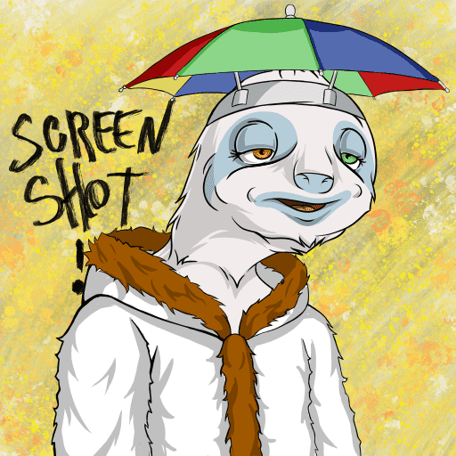

# Sleepy Sloth Society by Zzz Labs

Zzz Labs 统计的昏昏欲睡的树懒协会，创建于 9 个月前。

Zzz Labs NFT 的 Sleepy Sloth Society 在过去 7 天被售出 1 次。Zzz Labs 的 Sleepy Sloth Society 的总销售额为 120.76 美元。Zzz Labs NFT 的一个 Sleepy Sloth Society 的平均价格为 120.8 美元。Zzz Labs 拥有者共有 808 个 Sleepy Sloth Society，共拥有 2,222 个代币。

欢迎来到Sleepy Sloth Society，这是一个由 2,222 件独特作品组成的项目。该系列专注于创建一个弥合文化、教育和密码学之间差距的生态系统。在 Web3 上与我们一起小睡吧。

阅读我们的白皮书

昏昏欲睡的房子钥匙

通过 昏昏欲睡的血清即将被社会抛弃

欲了解更多信息，请访问我们的网站

如果您是持有者，请加入 Discord并验证您的角色。

访问我们所有的官方链接LinkTree

