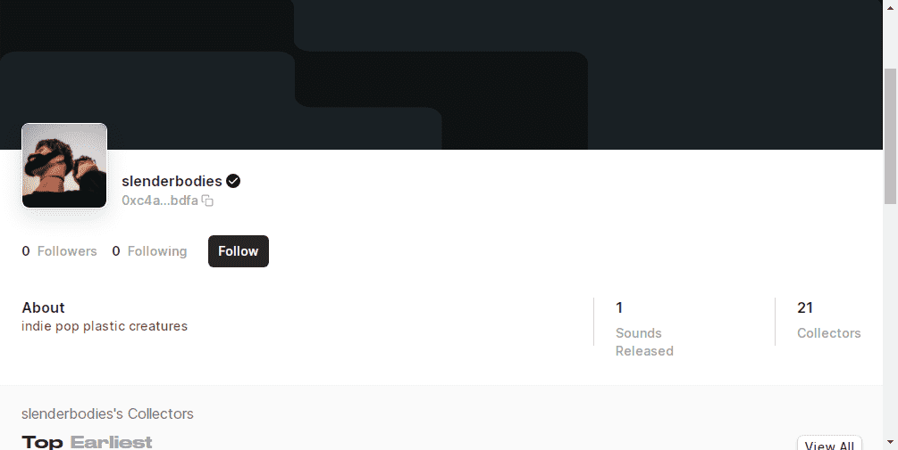

# slenderbodies

细长体统计
创建于 5 个月前
25代币供应
10% 费用
slenderbody NFT 在过去 7 天内售出 2 次。细长体的总销售额为 472.05 美元。一个细长体 NFT 的平均价格为 236 美元。有 21 个 slenderbody 拥有者，总共拥有 25 个代币。

由 Sound 上的 slenderbody 创建。
slenderbodies NFT - 常见问题（FAQ）
▶ 什么是纤细的身体？
slenderbodies 是一个 NFT（非同质代币）集合。存储在区块链上的数字艺术品集合。
▶ slenderbody 代币有多少？
总共有 25 个细长体 NFT。目前有 21 位车主的钱包里至少有一个细长体 NTF。
▶ 什么是最昂贵的细长体销售？
NFT 出售的最昂贵的细长体是 夜潜 #18。它于 2022 年 6 月 28 日（2 个月前）以 241.5 美元的价格售出。
▶ 最近卖出了多少个纤细的身体？
过去 30 天内售出了 2 个细长体 NFT。
▶ 什么是流行的细长体替代品？
许多拥有 slenderbody NFT 的用户也拥有 MELVV、 Sophia Alexa、 DLG。和 声音 xyz 上的花粉。

