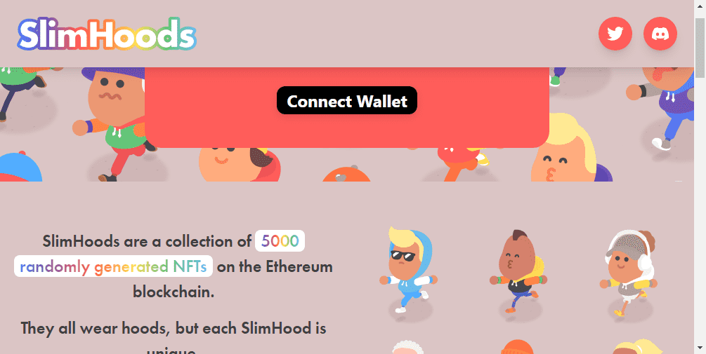

# SlimHoods Specials

SlimHoods 是以太坊区块链上5000 个随机生成的 NFT的集合。

他们都戴着头巾，但每个 SlimHood 都是独一无二的。
它从连帽衫开始，它使用从 10,000 种可能组合中的生成色块设计组装而成。
在连帽衫下面，SlimHoods 更加独特，具有多种特征，结合起来构成了数十亿种可能性！
有些特征比其他特征更罕见，一些非常特殊的 SlimHoods具有其他人没有的特征。

▶ 什么是 SlimHoods 特价商品？
SlimHoods Specials 是一个 NFT（非同质代币）系列。存储在区块链上的数字艺术品集合。
▶ 有多少 SlimHoods Specials 代币？
总共有 2 个 SlimHoods Specials NFT。目前，1,735 位车主的钱包中至少有一个 SlimHoods Specials NTF。
▶ 什么是最昂贵的 SlimHoods 特价商品？
出售的最昂贵的 SlimHoods Specials NFT 是 SlimHoods Special 的“Crosswalk”。它于 2022-06-10（3 个月前）以 41.3 美元的价格售出。
▶ 最近售出了多少 SlimHoods Specials？
过去 30 天内售出了 10 个 SlimHoods Specials NFT。
▶ 什么是流行的 SlimHoods Specials 替代品？
许多拥有 SlimHoods Specials NFT 的用户还拥有 HAPE YACHT CLUB、 KidPunks、 Bored Apes Punk Club和 Mr Cookie & The Smoking Monkey。

