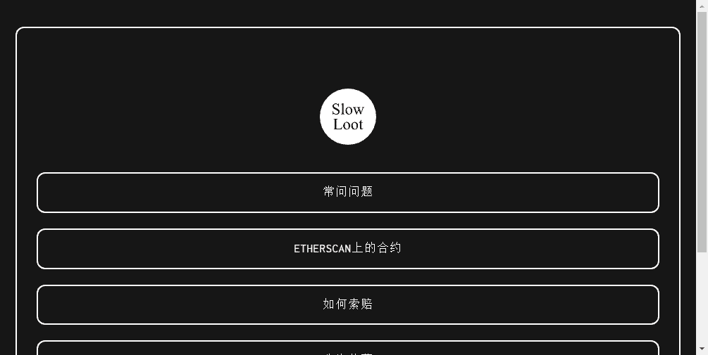

# Slow Loot

**什么是Slow Loot慢战利品？**

慢速战利品是战利品的免费副本（适用于冒险家）。有 8000 个 Slow Loot 代币可供免费索取。
为什么叫慢战利品？

1. 很慢，因为所有的代币都还没有被认领。最初的 8000 Loot 代币在大约 3 小时内被认领。Slow Loot 仍有可免费索取的代币（截至 2021-09-04）
2. 它很慢，因为 Slow Loot 生态系统的所有组件都是 Loot 生态系统的直接副本。慢速战利品上发生的一切总是落后于战利品上的等价物。作为一个 Slow Loot 代币持有者，你不能合理地期待任何创新。
3. 它很慢，因为人们声称拥有缓慢战利品的文化。现在正在发生 NFT 狂热。作为持续的紧迫感的替代方案，不要觉得有义务立即领取慢速战利品。不值钱，何必费心呢？你可以睡在上面，明天再拿一个。也许明天汽油会更便宜。

