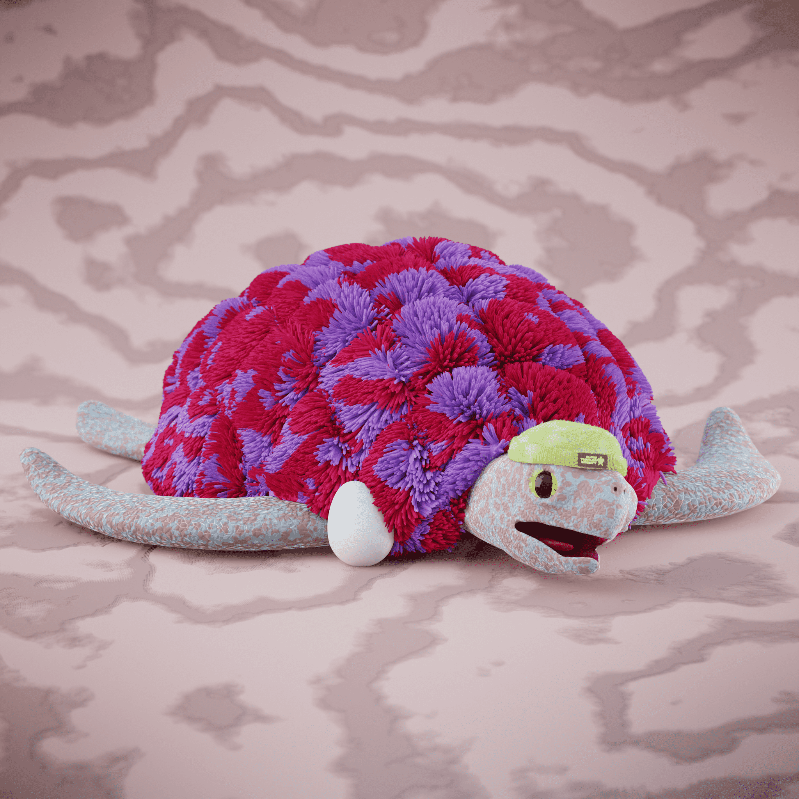

# Slow Turtles Official

999 只独特的海龟
Slow Turtles NFT 是 999 只独特的 Turtles 的集合，它们在 Polygon 区块链上团结在一起 

每只海龟都是由顶级设计师制作的独特 3D 模型。收藏中有33 只创世龟，持有其中一只将在项目后期为您带来优势！

持有一只慢龟意味着加入 NFT 社区内的迷你爱好者社团

沙盒集成
NFT 空间快速增长，我们的团队坚信每一个收藏都必须有一个实用性。

每位慢龟 NFT 的持有者都将能够收到他们龟的沙盒模型！这将允许持有者在游戏中代表我们的社区，为项目带来更多宣传，从而提高收藏的底价。

