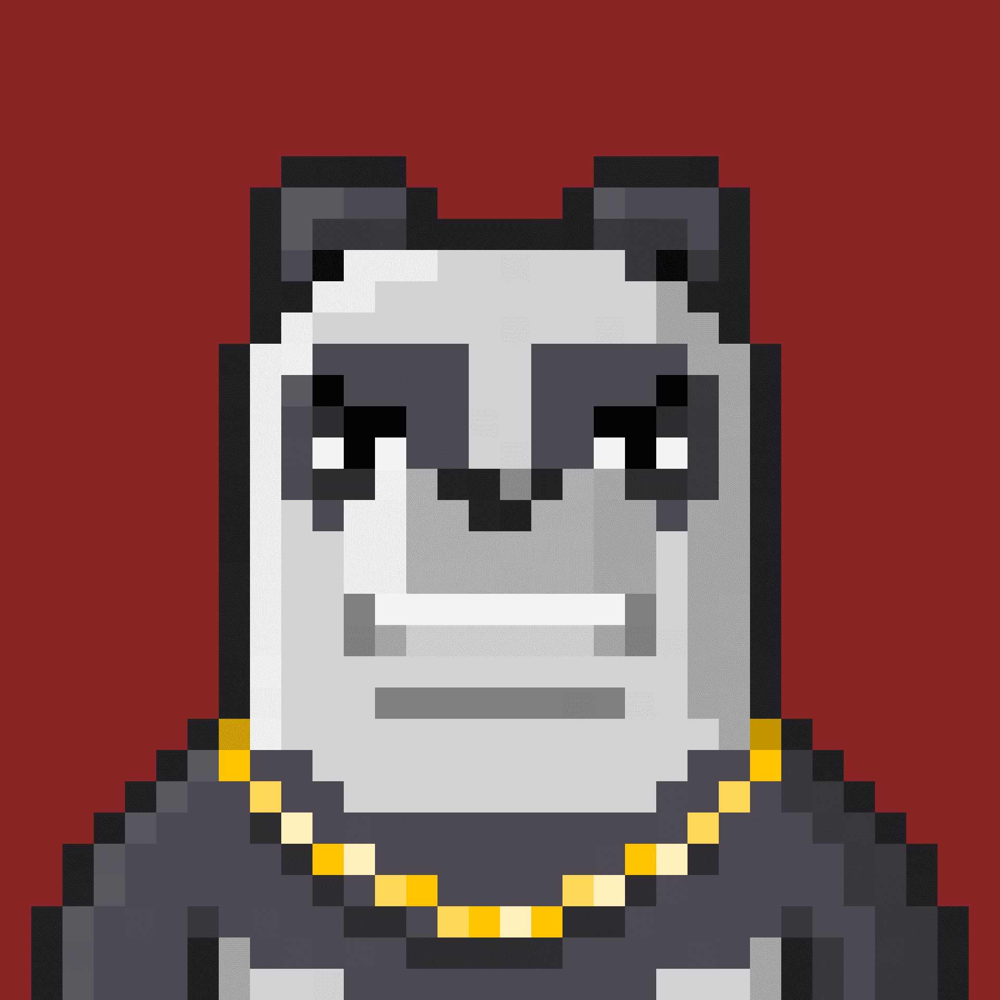

# slumbear millionaires

推出一个系列和造币厂需要多少钱?
推出一个系列是免费的!我们只收取初始铸币费的2.5%。与区块链(*)交互还需要支付本地费用( *)。
索拉纳
- 推出收藏:~0.013 SOL
  -铸造NFT:铸币价格+~0.017SOL
  以太坊/Fantom/Avalanche/Binance/Polygon

- 推出收藏:根据所选功能和 gas 价格变化
  -铸造 NFT:铸币价格+gas
  费用堆栈

- 启动集合:根据所选功能和gas 价格而变化

- 铸造 NFT:铸币价格+gas费

  我的收藏品会在市场上出售吗?
  是的!所有NFT集合都符合元数据标准,并与所有流行的市场兼容。
  索拉纳
  使用您的 CandyMachineID(自动提供)申请在SolSea 等热门市场上列出您的收藏!
  一旦人们开始从您的收藏中铸造 NFT,以太坊/多边形 收藏就会立即出现在OpenSea上!

  
