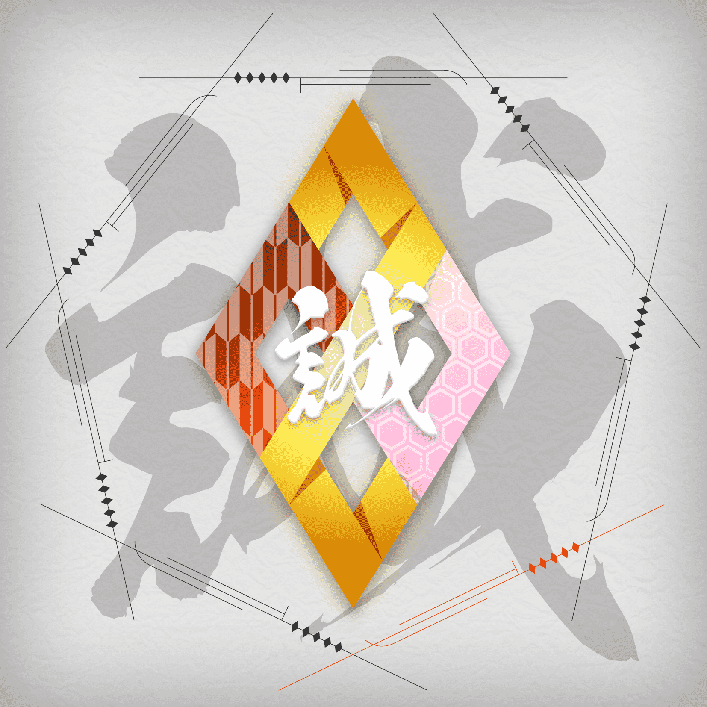

# SMC Symbol MakotoKobayashi

[SAMURAI cryptos ] NFT 遇上动漫，娱乐新境界开始。它从 7 位艺术家的 7 种武士艺术开始。““SAMURAI cryptos”是一个挑战共创项目为 NFT 时代打造全新动漫 IP。

[艺术家] 小林诚

[符号 NFT]

符号 NFT 表明您是武士，是 SAMURAI 密码项目的成员。
它将与七个“Samurai Legends Art”一起出售/分发。
有四种稀有物：Shogun、Ninja、Soldier 和 Stardust。
NFT 变体将由以下属性表示。(1) 符号设计
所有发行的符号 NFT 图像都会根据一定的规则有不同的设计。(2) 萨姆权利
这是在 Symbol NFT 上设置的“武士权利索引”。(3) 武士战利品
此关键字表示您作为武士的战利品。
 2021 GONZO KK，保留所有权利。由 double jump.tokyo Inc. 制作。”

