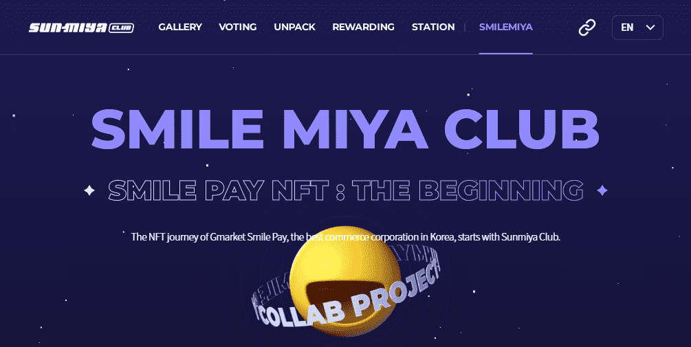

# SMILE MIYA CLUB-OFFICIAL

Gmarket Smile Pay 的 NFT 从与 Sunmiya Club 的合作项目开始，然后转向一个独特的独立项目。
加入与Sunmiya Club的合作项目“SMILE MIYA CLUB”，先享受福利。
“SMILE MIYA CLUB”发行 3,000 个基于 Klaytn 的 PFP NFTS，并使用
Smile Pay 的资源提供各种奖励，例如 Smile Cash 随机盒子和年费。
享受这些令人惊叹的 Smile Pay 福利，并在稍后进行的独立 Smile Pay PFP 项目上搭便车！

SMILE MIYA CLUB' 是 Sunmiya Club 和韩国代表性商业公司 Gmarket Smile Pay 的合作项目。这个项目是 Gmarket Smile Pay 的 NFT 之旅的开始，总共发行了 3,500 个基于 Klaytn 的 PFP，并提供各种好处，包含有Smile Pay资源的随机礼盒、Smile Club年费、持有者专属优惠券。“SMILE MIYA CLUB”是Gmarket Smile Pay独立PFP项目的OG类型社区，后续将上线，享受惊喜福利Smile Pay 和 Board on first to Smile Pay 的独立 PFP 项目将在稍后开放！“Smile Miya Club”是 Sunmiya Club 与韩国代表性商业公司 Gmarket Smile Pay 的合作项目。该项目是 NFT 旅程的开始，基于Klaytn共发行3500个PFP，并提供使用Smile Pay资源的随机盒子、Smile Club年费、持有人专属优惠券等多种福利，是Market Smile Pay读者PFP项目的OG社区，稍后将与Smile Pay项目对接，享受Smile Pay的惊喜福利，抢先登上全新的Reader Smile Pay PFP项目！

