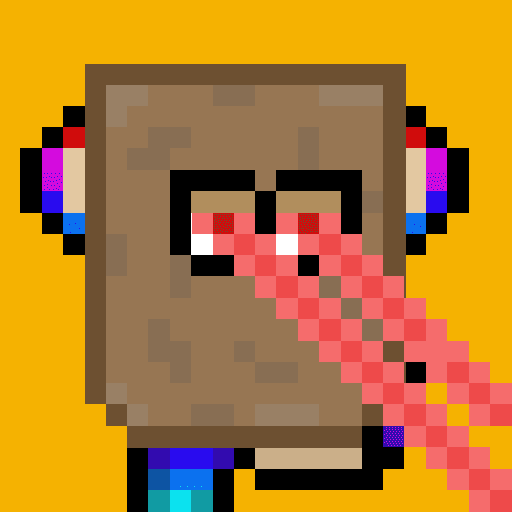

# SmolApes

池塘为蟾蜍做的!这个私人池塘位于一个安全的绝密位置,
专为 Toadles 社区的VIP成员开放。 每个蟾蜍都是国王。每个 Toadle 都是独特的并以编程方式生成的特征, 包括来自 Doodles 和 Cryptoadz 的服装、鬃毛、表情等。-Rarity.tools,第一次直播
- 为所有揭示 1/1 Toadle 的持有者提供ETH赠品(将在50%铸造后开始) -5%铸币厂收益存入社区钱包,持有人投票分配资金
  -“魔杖”空投给所有持有者。收到魔杖后,您可以更改 Toadles 属性!
  第三阶段
  -2%的售后销售将投入长期质押。
  -新的营销计划

- Toadles 的奖励持有者 -
  雇用新的团队成员(社区经理和开发人员)
  与 Twitter 影响者合作

  
