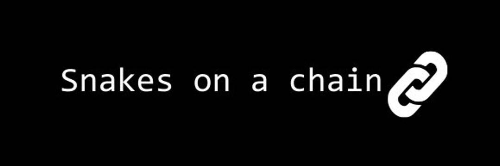

# Snakes On A Chain

是一个 nft 项目，其中在随机生成的背景上生成随机 svg 蛇。
这可以在沙漠、水中或太空中！🪐

一条蛇的价格是 0.015 Ξ
您可以在下面购买多个。（一笔交易最多 20 个）
636 /2000 铸造,蛇的外观和运动都是随机生成的并且是独一无二的。
这就是为什么我们说每条蛇都有自己的人生轨迹。喜欢你也应该！

蛇完全生活在以太坊区块链上⛓️
所有图像数据都存储在合约中，因此艺术是完全去中心化的。

