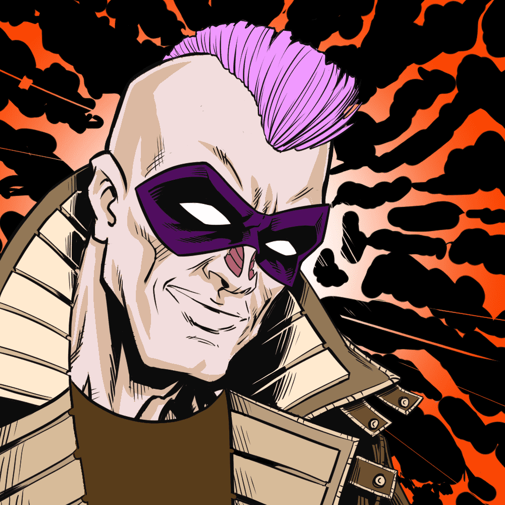

# Snap Universe

它是以太坊区块链上 10,000 名英雄和恶棍的家。
折断！旨在成为用户为漫画创建多元宇宙的第一个去中心化中心；创作者、作家和艺术家的新家。成员通过招募生活在快宇宙中的 10,000 名英雄和恶棍之一作为他们的化身，决定他们的背景故事和权力。SNAP UNIVERSE PFP,快速多元宇宙中的 600 名不朽英雄和恶棍这些角色不仅仅是 NFT 收藏，还是讲述您的故事、组队、跨界、战斗等的蓝图！ NFT 已发布
通过语音和/或文字讨论他们喜欢/不喜欢漫画/故事的社区会议
SNAP漫画书订阅及漫画书NFT日期公告
Q1-Q2 / 2022

