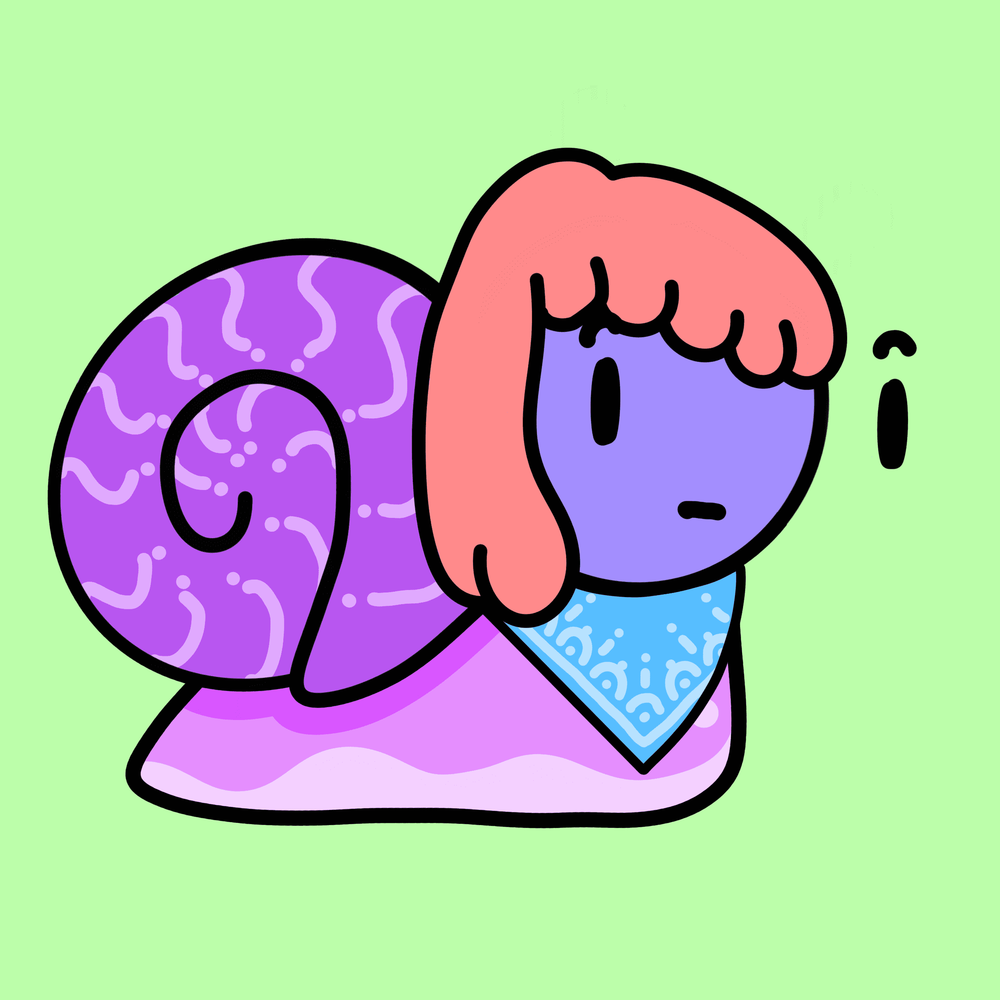

# Snoodles Official

什么是面条?
在毁灭性的原子彩虹摧毁了他们所知道的一切之后,独特、手绘 完全随机的 Snoodles 被迫离开他们心爱的 Doodle 星球。
幸运的是,他们的速度足够快, 的是,他们现在迷失在太空中,
能够及时登上宇宙飞船逃走!不幸 在以太坊区块链上寻找永远的家。我们的路线图
1. 启动
  我们将进行一次隐形发射,我们的 OG discord 成员将首 先收到通知。5分钟后,普通会员将收到铸币链接通知。 再过 10 分钟后,我们将在推特上发布链接。

2. 社区赠品
  在铸造 50% 时,团队将提取 ETH 以购买涂鸦,以赠送给 一位幸运的 Snoodles 持有者!
  在100% 铸造时,我们将购买另一个 Doodle 来赠送

  
