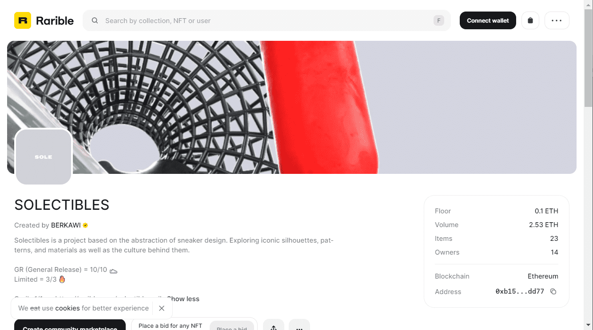

# SOLECTIBLES

可选的
由...制作 
贝卡维
Solectibles 是一个基于运动鞋设计抽象的项目。探索标志性的轮廓、图案和材料以及它们背后的文化。GR（一般发行版）= 10/10 👟 限量版 = 3/3 🔥 Grails 1/1 -...

SOLECTIBLES NFT - 常见问题（FAQ）
▶ 什么是 SOLECTIBLES？
SOLECTIBLES 是一个 NFT（不可替代代币）集合。存储在区块链上的数字艺术品集合。
▶ 有多少个 SOLECTIBLES 代币？
总共有 3 个 SOLECTIBLES NFT。目前，14 位所有者的钱包中至少有一个 SOLECTIBLES NTF。
▶ 最近卖出了多少 SOLECTIBLES？
过去 30 天内售出 0 个 SOLECTIBLES NFT。

