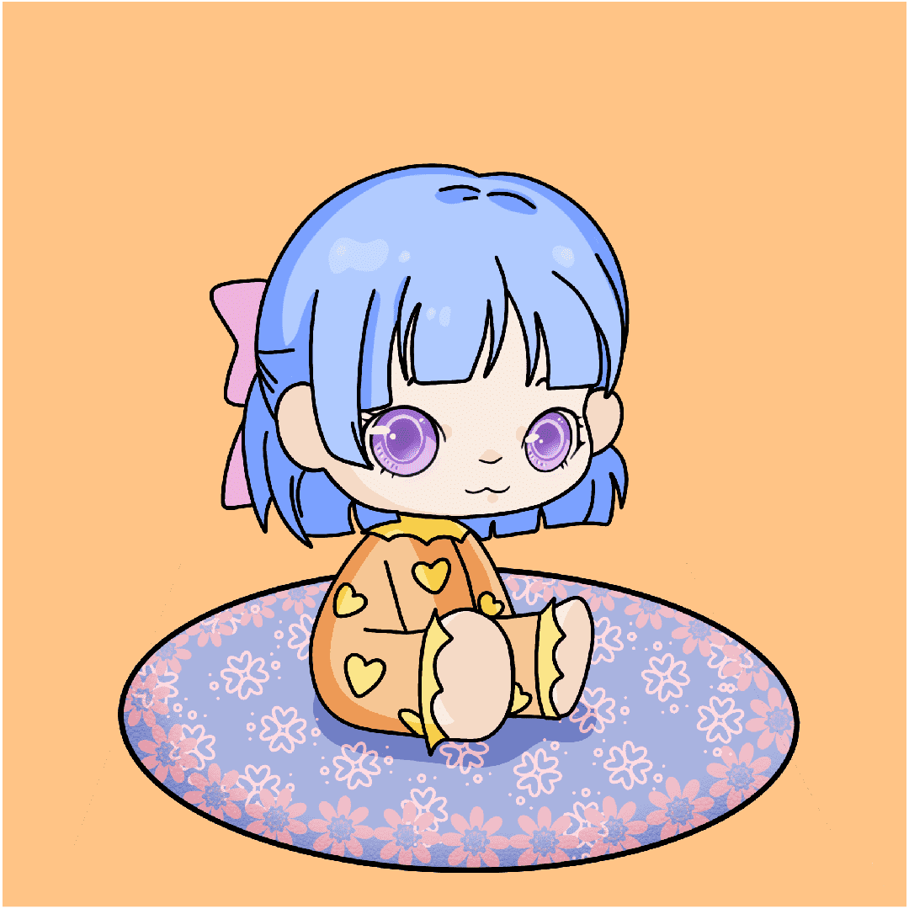

# Something Of An Artist

Some of An Artist 是 5555 位来自不同社会经济背景的独特艺术家的集合，这些艺术家经过精心设计并绑定到各自的画布上。该系列将与 My Canvas 系列一起发展，并向所有 Web3 梦想家传达重要的社会学信息。
1 Mint = 1 Artist NFT + 1 Canvas NFT
您的艺术家和您的画布绑定在一起！如果 您出售或转让其中一个，则两个 NFT 将 一起转出。
我们在我们的合同中称其为“灵魂绑定”机制：在 铸币厂，您批准“艺术家的东西”合同，将 Canvas NFT 转移到 Artist NFT 转移到的同一个钱包中。反之亦然，您还同意 The Canvas 合同将您的 Artist NFT 从您的钱包转移到 The Canvas NFT 转移到的同一个钱包中。
您不同意我们访问您的任何其他 NFT。如果 您仍然不安全，请使用

